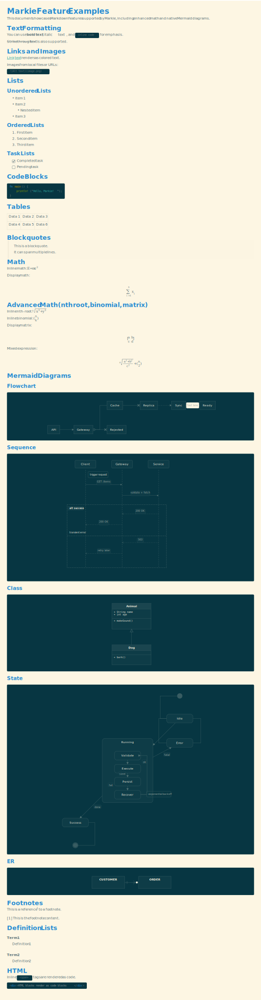
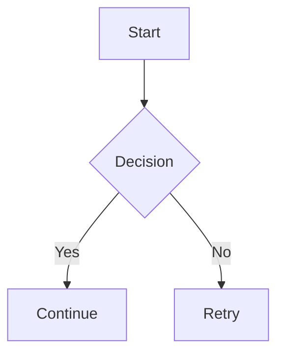

# Markie



A pure Rust Markdown to SVG/PNG/PDF renderer that converts Markdown documents into beautiful, shareable images.

## Features

- **Pure Rust**: Built entirely with Rust for performance and reliability
- **Multiple Output Formats**: Export to SVG, PNG, or PDF
- **High-Resolution PNG Output**: Use `--png-scale` for sharper raster output
- **Native Mermaid Rendering**: Flowchart, sequence, class, state, and ER diagrams (including advanced edge/control syntax)
- **Enhanced Math Rendering**: LaTeX-style math including nth roots, binomials, and matrices
- **Customizable Themes**: Supports Alacritty theme files (`.yaml`/`.toml`)
- **Flexible Input**: Read from file or stdin
- **Adjustable Width**: Control output image width
- **Font Support**: Includes local font directory, system fallback, and global font caching

## Markdown Support

Supported today:

- Headings, paragraphs, emphasis/strong, inline code
- Fenced code blocks with syntax highlighting
- Lists (ordered/unordered) and task lists
- Blockquotes and horizontal rules
- Links (colored text)
- Strikethrough
- Tables
- Images (local files, data URLs, and remote HTTP/S sources)
- Inline and display math (LaTeX-style; supports nth roots, binomials, and matrices)
- Footnotes
- Definition lists
- **Mermaid diagrams** (flowchart, sequence, class, state, ER)
- Inline HTML and HTML blocks (rendered as code)
- **Improved typography and spacing** for better visual consistency

See [examples.md](examples.md) for comprehensive examples of all supported features.

Not yet supported:

- Metadata blocks are parsed but ignored
- Rich HTML rendering (HTML is rendered as inline code or code blocks)

### Mermaid Diagram Support

Markie supports Mermaid diagrams natively in Rust. Use `mermaid` code blocks:

````markdown

````

Supported diagram types:
- **Flowchart**: `flowchart TD/LR` with nodes (rect, rounded, diamond, circle), labels, and arrow variants (circle/cross/open, bidirectional, thick, dotted)
- **Sequence**: `sequenceDiagram` with participants, messages, notes, and control blocks (`alt`, `opt`, `loop`, `par`, `critical` + `else`/`end`)
- **Class**: `classDiagram` with classes, attributes, methods, and relationships
- **State**: `stateDiagram` with states, transitions, composite state children, and notes
- **ER**: `erDiagram` with entities and relationships

### Enhanced Math Support

Math is rendered natively from LaTeX-style input, including:
- nth roots (`\sqrt[3]{x}`)
- binomials (`\binom{n}{k}`)
- matrices (`\begin{bmatrix} ... \end{bmatrix}`)

Example:

```markdown
Inline: $\sqrt[3]{x^3 + y^3}$ and $\binom{n}{k}$

$$
\begin{bmatrix}
a & b \\
c & d
\end{bmatrix}
$$
```

## Installation

### From source

```bash
cargo install --path .
```

## Usage

### Basic usage

Render a Markdown file to SVG:

```bash
markie input.md -o output.svg
```

Render to PNG:

```bash
markie input.md -o output.png
```

Render to PDF:

```bash
markie input.md -o output.pdf
```

Render a sharper PNG (2x raster scale):

```bash
markie input.md -o output.png --png-scale 2
```

### From stdin

```bash
cat README.md | markie - -o output.svg
```

### Custom width

```bash
markie input.md -o output.png --width 1200
```

### With Alacritty theme (YAML or TOML)

You can use any Alacritty theme directly (both `.yaml` and `.toml` formats are supported).
A great collection of themes can be found at [alacritty-theme](https://github.com/alacritty/alacritty-theme).

```bash
markie input.md -o output.svg --theme tests/fixtures/solarized_light.toml
```

Combine theme + high-res PNG:

```bash
markie input.md -o output.png --theme tests/fixtures/solarized_light.toml --png-scale 2
```

### Smoke test script

A local smoke-test helper is included to verify math, Mermaid, theme handling, and all output formats.

```bash
./scripts/smoke-test.sh ./smoke-test-output
```

Optional overrides:

```bash
THEME_FILE=tests/fixtures/solarized_light.toml PNG_SCALE=2 ./scripts/smoke-test.sh ./smoke-test-output
```

## Theme Format

Themes can be passed as a path to an Alacritty theme file (YAML or TOML).

Example of Alacritty TOML theme:

```toml
[colors.primary]
background = '#fdf6e3'
foreground = '#586e75'

[colors.normal]
black   = '#073642'
red     = '#dc322f'
green   = '#859900'
# ... other colors
```

## Building

```bash
cargo build --release
```

The binary will be available at `target/release/markie`.

## Dependencies

- `cosmic-text`: Text shaping and layout
- `pulldown-cmark`: Markdown parsing
- `resvg` + `tiny-skia`: SVG/PNG rendering
- `svg2pdf`: PDF export
- `syntect`: Syntax highlighting
- `clap`: Command-line argument parsing
- `serde`: Serialization/Deserialization (JSON, YAML, TOML)
- `latex2mathml` + `quick-xml`: Math rendering
- `lru` + `parking_lot`: Global font measurement cache

## License

This project is provided as-is for educational and personal use.

## Contributing

Contributions are welcome! Please feel free to submit a Pull Request.
