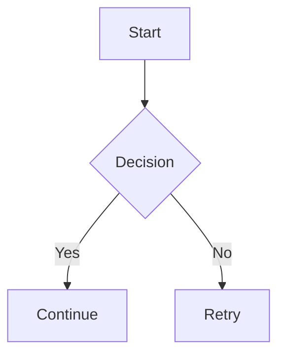

# Markie


A pure Rust Markdown to SVG/PNG/PDF renderer that converts Markdown documents into beautiful, shareable images.

## Features

- **Pure Rust**: Built entirely with Rust for performance and reliability
- **Zero Runtime Dependencies**: Single static binary with no Node.js, Python, or external runtime required
- **Multiple Output Formats**: Export to SVG, PNG, or PDF
- **High-Resolution PNG Output**: Use `--png-scale` for sharper raster output
- **Native Mermaid Rendering**: Flowchart, sequence, class, state, and ER diagrams (including advanced edge/control syntax)
- **Improved Mermaid Layout**: Sparser node spacing and collision-aware edge label placement
- **Enhanced Math Rendering**: LaTeX-style math including nth roots, binomials, and matrices
- **Customizable Themes**: Supports Alacritty theme files (`.yaml`/`.toml`)
- **12 Built-in Themes**: Dracula, Nord, Tokyo Night, Catppuccin, Gruvbox, and more — or use any Alacritty theme file
- **Smart Defaults**: `markie input.md` → `input.png` at 2× retina scale, no flags needed
- **Shell Completions**: `--completions bash/zsh/fish/powershell/elvish`
- **Flexible Input**: Read from file or stdin
- **Adjustable Width**: Control output image width (default: 1200px)
- **Font Support**: Includes local font directory, system fallback, and global font caching
- **XML-Safe Output**: Invalid XML control characters are stripped during rendering

## Why Markie?

| Feature | Markie | JavaScript-based Alternatives |
|---------|--------|------------------------------|
| **Runtime** | Zero - single binary | Requires Node/Bun/Deno |
| **Output Formats** | SVG, PNG, PDF | Typically SVG only |
| **Full Markdown** | Complete renderer | Diagrams only |
| **LaTeX Math** | Native support | Usually not available |
| **Syntax Highlighting** | Built-in | Separate setup required |
| **Deployment** | Copy and run | npm install + runtime |

**Key advantages:**

- **All-in-one renderer** - Complete markdown documents with embedded Mermaid diagrams and LaTeX math in a single tool
- **PDF export** - Production-ready PDFs with text-as-paths for universal viewer compatibility
- **Single-binary distribution** - No runtime version management, dependency resolution, or `npm install` needed
- **Native performance** - Rust's zero-cost abstractions for fast, memory-efficient rendering

## Markdown Support

Supported today:

- Headings, paragraphs, emphasis/strong, inline code
- Fenced code blocks with syntax highlighting
- Lists (ordered/unordered) and task lists
- Blockquotes and horizontal rules
- Links (colored text)
- Strikethrough
- Tables
- Images (local files, data URLs, and remote HTTP/S sources)
- Inline and display math (LaTeX-style; supports nth roots, binomials, and matrices)
- Footnotes
- Definition lists
- **Mermaid diagrams** (flowchart, sequence, class, state, ER)
- Inline HTML and HTML blocks (rendered as code)
- **Improved typography and spacing** for better visual consistency

See [examples.md](examples.md) for comprehensive examples of all supported features.

Not yet supported:

- Metadata blocks are parsed but ignored
- Rich HTML rendering (HTML is rendered as inline code or code blocks)

### Mermaid Diagram Support

Markie supports Mermaid diagrams natively in Rust. Use `mermaid` code blocks:

````markdown

````

Supported diagram types:
- **Flowchart**: `flowchart TD/LR` with nodes (rect, rounded, diamond, circle), labels, and arrow variants (circle/cross/open, bidirectional, thick, dotted)
- **Sequence**: `sequenceDiagram` with participants, messages, notes, and control blocks (`alt`, `opt`, `loop`, `par`, `critical` + `else`/`end`)
- **Class**: `classDiagram` with classes, attributes, methods, and relationships
- **State**: `stateDiagram` with states, transitions, composite state children, and notes
- **ER**: `erDiagram` with entities and relationships

Rendering notes:
- Diagram layout is intentionally sparse for readability.
- Edge labels are offset and collision-checked against nodes and nearby labels.

### Enhanced Math Support

Math is rendered natively from LaTeX-style input, including:
- nth roots (`\sqrt[3]{x}`)
- binomials (`\binom{n}{k}`)
- matrices (`\begin{bmatrix} ... \end{bmatrix}`)

Example:

```markdown
Inline: $\sqrt[3]{x^3 + y^3}$ and $\binom{n}{k}$

$$
\begin{bmatrix}
a & b \\
c & d
\end{bmatrix}
$$
```

## Installation

### From crates.io

```bash
cargo install markie
```

### Fast install with cargo-binstall

```bash
cargo binstall markie
```

### From source

```bash
cargo install --path .
```

### Prebuilt binaries

Download from [GitHub Releases](https://github.com/lsj5031/markiecli/releases) for Linux (x86_64, aarch64), macOS (x86_64, Apple Silicon), and Windows.

### One-line installer (Linux/macOS)

```bash
curl -fsSL https://raw.githubusercontent.com/lsj5031/MarkieCli/master/scripts/install.sh | sh
```

Optional environment overrides:

```bash
MARKIE_VERSION=0.3.0 INSTALL_DIR="$HOME/.local/bin" curl -fsSL https://raw.githubusercontent.com/lsj5031/MarkieCli/master/scripts/install.sh | sh
```

## Usage

### Basic usage

```bash
# Render to PNG (default output format, 2× retina scale)
markie input.md

# Explicit output format
markie input.md -o output.svg
markie input.md -o output.png
markie input.md -o output.pdf
```

### From stdin

```bash
cat README.md | markie - -o output.svg
```

### Custom width

```bash
markie input.md -o output.png --width 1200
```

### Built-in themes

12 built-in themes from [alacritty-theme](https://github.com/alacritty/alacritty-theme) are bundled:

```bash
markie input.md --theme dracula
markie input.md --theme nord
markie input.md --theme tokyo_night
markie --list-themes   # Show all available themes
```

Available: `catppuccin_latte`, `catppuccin_mocha`, `dracula`, `github_dark`, `github_light`, `gruvbox_dark`, `gruvbox_light`, `monokai_pro`, `nord`, `solarized_dark`, `solarized_light` (default), `tokyo_night`

You can also pass a path to any Alacritty theme file (YAML or TOML):

```bash
markie input.md --theme ~/my-custom-theme.toml
```

### Smoke test script

A local smoke-test helper is included to verify math, Mermaid, theme handling, and all output formats.

```bash
./scripts/smoke-test.sh ./smoke-test-output
```

Optional overrides:

```bash
THEME_FILE=tests/fixtures/solarized_light.toml PNG_SCALE=2 ./scripts/smoke-test.sh ./smoke-test-output
```

## Theme Format

Themes can be passed as a path to an Alacritty theme file (YAML or TOML).

Example of Alacritty TOML theme:

```toml
[colors.primary]
background = '#fdf6e3'
foreground = '#586e75'

[colors.normal]
black   = '#073642'
red     = '#dc322f'
green   = '#859900'
# ... other colors
```

## Building

```bash
cargo build --release
```

The binary will be available at `target/release/markie`.

## Dependencies

- `cosmic-text`: Text shaping and layout
- `pulldown-cmark`: Markdown parsing
- `resvg` + `tiny-skia`: SVG/PNG rendering
- `svg2pdf`: PDF export
- `syntect`: Syntax highlighting
- `clap`: Command-line argument parsing
- `serde`: Serialization/Deserialization (JSON, YAML, TOML)
- `latex2mathml` + `quick-xml`: Math rendering
- `lru` + `parking_lot`: Global font measurement cache

## Status

This is an early experiment. The renderer works well for common use cases, but there's plenty of room for improvement in layout, styling, and feature completeness. PRs welcome to make it better!

## License

MIT License. See [LICENSE](LICENSE) for details.

## Contributing

Contributions are welcome! Please feel free to submit a Pull Request.
