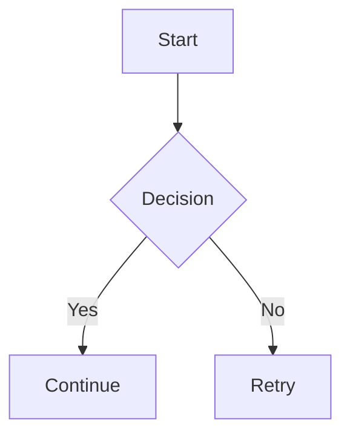

# Markie


A pure Rust Markdown to SVG/PNG renderer that converts Markdown documents into beautiful, shareable images.

## Features

- **Pure Rust**: Built entirely with Rust for performance and reliability
- **Multiple Output Formats**: Export to SVG or PNG
- **Customizable Themes**: Support for custom themes via Alacritty configuration files (YAML/TOML)
- **Flexible Input**: Read from file or stdin
- **Adjustable Width**: Control output image width
- **Font Support**: Includes local font directory and system font fallbacks

## Markdown Support

Supported today:

- Headings, paragraphs, emphasis/strong, inline code
- Fenced code blocks with syntax highlighting
- Lists (ordered/unordered) and task lists
- Blockquotes and horizontal rules
- Links (colored text)
- Strikethrough
- Tables
- Images (local files, data URLs, and remote HTTP/S sources)
- Inline and display math (rendered with LaTeX support)
- Footnotes
- Definition lists
- **Mermaid diagrams** (flowchart, sequence, class, state, ER)
- Inline HTML and HTML blocks (rendered as code)
- **Improved typography and spacing** for better visual consistency

See [examples.md](examples.md) for comprehensive examples of all supported features.

Not yet supported:

- Metadata blocks are parsed but ignored
- Rich HTML rendering (HTML is rendered as inline code or code blocks)

### Mermaid Diagram Support

Markie supports Mermaid diagrams natively in Rust. Use `mermaid` code blocks:

````markdown

````

Supported diagram types:
- **Flowchart**: `flowchart TD/LR` with nodes (rect, rounded, diamond, circle) and labeled edges
- **Sequence**: `sequenceDiagram` with participants and messages
- **Class**: `classDiagram` with classes, attributes, methods, and relationships
- **State**: `stateDiagram` with states and transitions
- **ER**: `erDiagram` with entities and relationships

## Installation

### From source

```bash
cargo install --path .
```

## Usage

### Basic usage

Render a Markdown file to SVG:

```bash
markie input.md -o output.svg
```

Render to PNG:

```bash
markie input.md -o output.png
```

### From stdin

```bash
cat README.md | markie - -o output.svg
```

### Custom width

```bash
markie input.md -o output.png --width 1200
```

### With Alacritty theme (YAML or TOML)

You can use any Alacritty theme directly (both `.yaml` and `.toml` formats are supported).
A great collection of themes can be found at [alacritty-theme](https://github.com/alacritty/alacritty-theme).

```bash
markie input.md -o output.svg --theme solarized_light.toml
```

## Theme Format

Themes can be passed as a path to an Alacritty theme file (YAML or TOML).

Example of Alacritty TOML theme:

```toml
[colors.primary]
background = '#fdf6e3'
foreground = '#586e75'

[colors.normal]
black   = '#073642'
red     = '#dc322f'
green   = '#859900'
# ... other colors
```

## Building

```bash
cargo build --release
```

The binary will be available at `target/release/markie`.

## Dependencies

- `cosmic-text`: Text shaping and layout
- `pulldown-cmark`: Markdown parsing
- `resvg`: SVG rendering
- `tiny-skia`: Software rendering
- `syntect`: Syntax highlighting
- `clap`: Command-line argument parsing
- `serde`: Serialization/Deserialization (JSON, YAML, TOML)
- `latex2mathml`: Math rendering

## License

This project is provided as-is for educational and personal use.

## Contributing

Contributions are welcome! Please feel free to submit a Pull Request.
