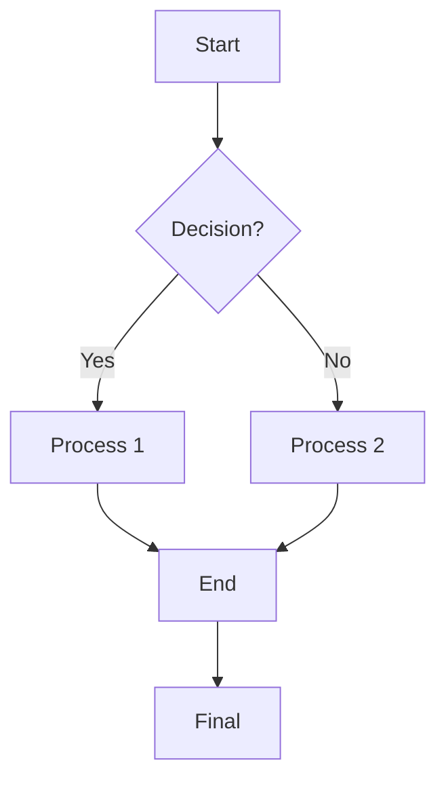
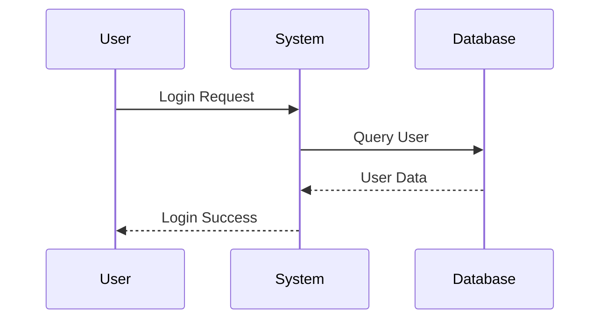
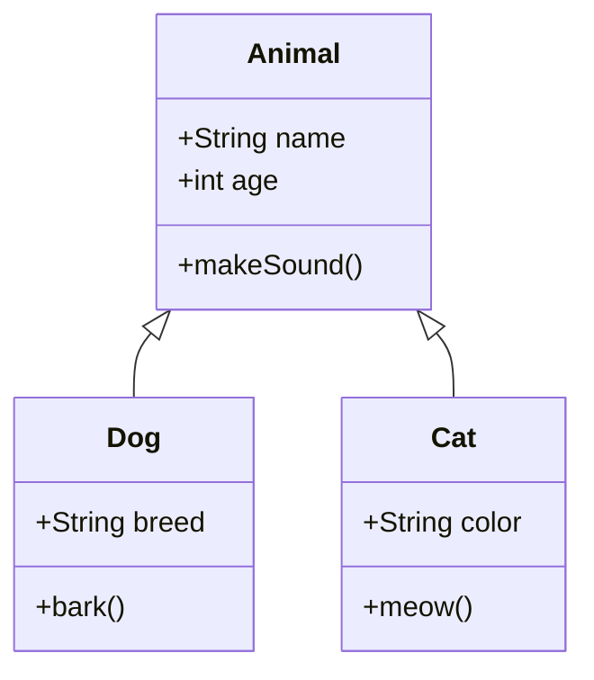
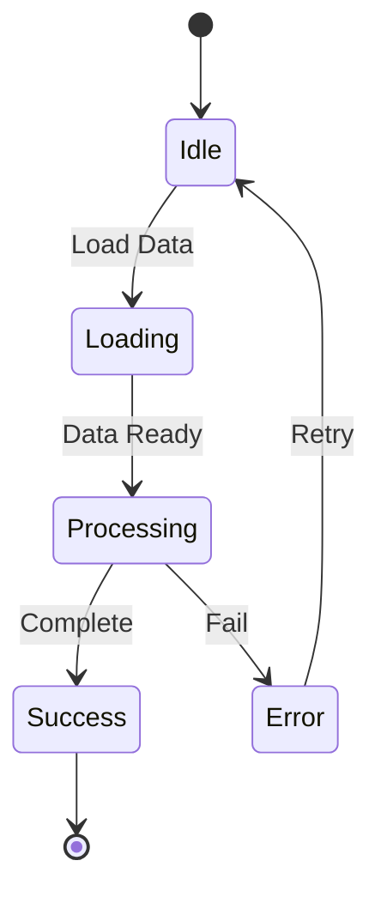
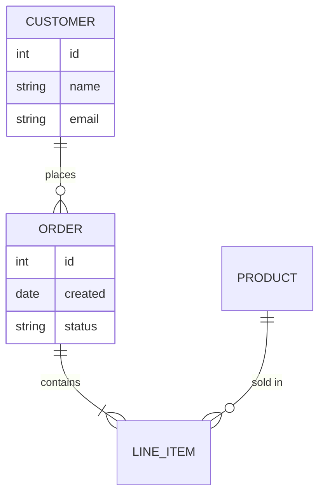

# Markie CLI Demo - All Features Showcase

Welcome to Markie! This document demonstrates all the features available in the Markie CLI markdown renderer.

---

## 1. Basic Markdown

### Headers

# H1 Header
## H2 Header
### H3 Header
#### H4 Header

### Text Formatting

This is **bold text**, *italic text*, and ***bold italic***.

Inline `code` and ~~strikethrough~~ text.

> Blockquote with **bold** and *italic*

### Lists

Unordered list:
- Item one
- Item two
  - Nested item
- Item three

Ordered list:
1. First item
2. Second item
3. Third item

---

## 2. GFM (GitHub Flavored Markdown) Features

### Task Lists

- [x] Completed task
- [x] Another done task
- [ ] Pending task
- [ ] Another pending task

### Autolinks

Visit https://example.com for more info.

Go to http://test.org today.

### Footnotes

Here is a footnote reference[^1].

[^1]: This is the footnote definition. It can contain multiple lines and **formatting**.

### Definition Lists

Apple
: A fruit that is red or green

Banana
: A long yellow fruit

Cherry
: A small red fruit

### Tables

| Left Align | Center Align | Right Align |
|:-----------|:------------:|------------:|
| Cell A1    |   Cell B1    |       Cell C1 |
| Cell A2    |   Cell B2    |       Cell C2 |

---

## 3. Code Blocks

### Rust Code

```rust
fn main() {
    let message = "Hello, World!";
    println!("{}", message);
    
    let numbers = vec![1, 2, 3, 4, 5];
    for n in numbers.iter() {
        println!("Number: {}", n);
    }
}
```

### Python Code

```python
def greet(name: str) -> str:
    """Return a greeting message."""
    return f"Hello, {name}!"

if __name__ == "__main__":
    print(greet("World"))
```

### JSON

```json
{
  "name": "Markie",
  "version": "0.4.0",
  "features": ["markdown", "mermaid", "math"]
}
```

---

## 4. Math Rendering

### Inline Math

Inline equation: $E = mc^2$

Inline binomial: $\binom{n}{k}$

Inline square root: $\sqrt{x^2 + y^2}$

### Display Math

Matrix:

$$
\begin{bmatrix}
a & b & c \\
d & e & f \\
g & h & i
\end{bmatrix}
$$

Aligned equations:

$$
\begin{aligned}
ax + by &= c \\
dx + ey &= f
\end{aligned}
$$

Cases (simplified):

$$
f(x) = \begin{cases}
x + 1 & x > 0 \\
x - 1 & x \leq 0
\end{cases}
$$

Complex expression:

$$
\sqrt[3]{\frac{a^2 + b^2}{c^2}} + \sum_{i=1}^{n} i^2
$$

---

## 5. Mermaid Diagrams

### Flowchart



### Sequence Diagram



### Class Diagram



### State Diagram



### ER Diagram



---

## 6. Combined Example

### Project Checklist

- [x] Set up project structure
- [x] Implement markdown parsing
- [x] Add Mermaid diagram support
- [x] Add math rendering
- [ ] Write comprehensive tests
- [ ] Deploy to production

### Links and References

For more information visit:
- Official docs: https://markie.dev
- GitHub: http://github.com/example/markie

### Summary

This document demonstrates that Markie can render:

1. **Markdown** - Headers, lists, text formatting, code blocks
2. **GFM Features** - Task lists, autolinks, footnotes, definition lists, tables
3. **Math** - Inline and display math with matrices, equations, and more
4. **Mermaid** - Flowcharts, sequence diagrams, class diagrams, state diagrams, ER diagrams

---

## 7. Theme Examples

Markie supports multiple themes. Use `--theme` or `-t` to select:

### Solarized Light (Default)

```bash
markie demo-all-features.md -o output.svg -t solarized_light
```

### Solarized Dark

```bash
markie demo-all-features.md -o output.svg -t solarized_dark
```

### Dracula

```bash
markie demo-all-features.md -o output.svg -t dracula
```

### Nord

```bash
markie demo-all-features.md -o output.svg -t nord
```

### Catppuccin Mocha

```bash
markie demo-all-features.md -o output.svg -t catppuccin_mocha
```

### Available Themes

Run `--list-themes` to see all available themes:
- catppuccin_latte, catppuccin_mocha
- dracula, everforest
- github_dark, github_light
- gruvbox_dark, gruvbox_light
- monokai_pro, nord
- solarized_dark, solarized_light
- tokyo_night

---

*Generated with Markie CLI v0.4.0*