# Markie Documentation Index

> Welcome to the Markie documentation. This index helps you navigate the detailed explanation documents.

## What is Markie?

Markie is a **pure Rust** command-line tool that converts Markdown documents into beautiful images (SVG, PNG, or PDF). It supports:

- Complete Markdown syntax
- Mermaid diagrams (flowchart, sequence, class, state, ER)
- LaTeX math expressions
- Syntax-highlighted code blocks
- Customizable themes

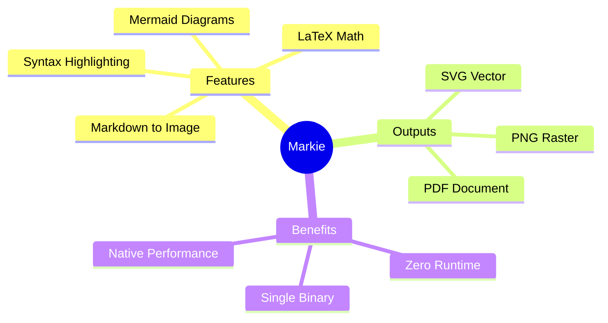

## Documentation Overview

Here's how the documentation is organized:

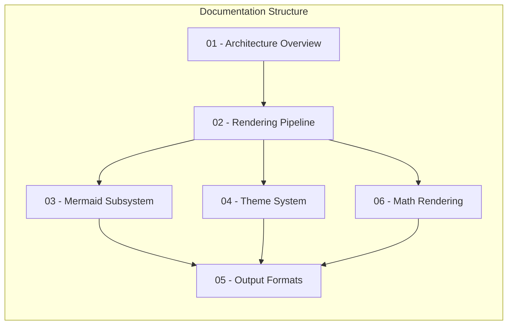

## Document Summaries

### 1. [Architecture Overview](01-architecture-overview.md)

Learn about Markie's overall system design:

- High-level pipeline architecture
- Core components and their responsibilities
- Data flow through the system
- Key design decisions

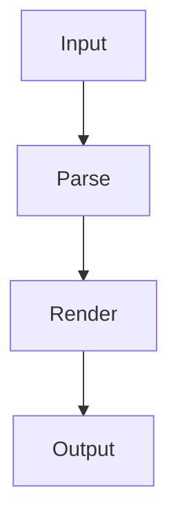

**Who should read:** Anyone wanting to understand how Markie works at a high level.

---

### 2. [Rendering Pipeline](02-rendering-pipeline.md)

Deep dive into the Markdown-to-SVG transformation:

- Markdown parsing with pulldown-cmark
- Event-driven rendering
- Text measurement and layout
- Special block handling (code, tables, images)

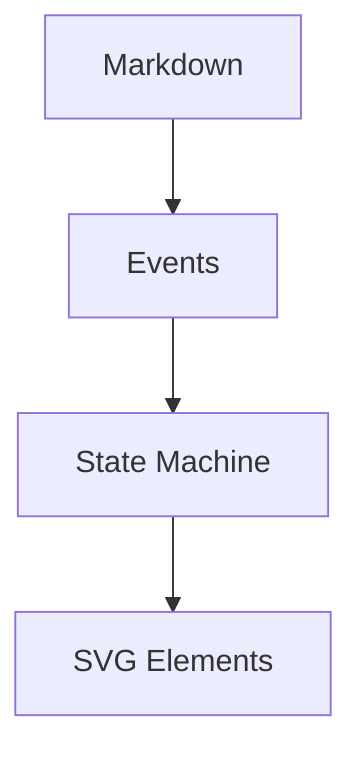

**Who should read:** Those interested in the core rendering logic.

---

### 3. [Mermaid Subsystem](03-mermaid-subsystem.md)

Understand how Mermaid diagrams are rendered natively:

- Supported diagram types
- Parsing Mermaid syntax
- Layout algorithms
- SVG generation

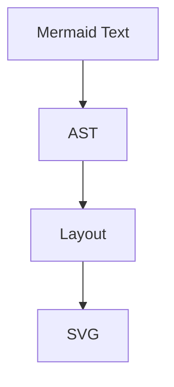

**Who should read:** Anyone using or extending Mermaid diagram support.

---

### 4. [Theme System](04-theme-system.md)

Learn about visual customization:

- Theme properties
- Alacritty theme format support
- Color mapping logic
- Typography and spacing

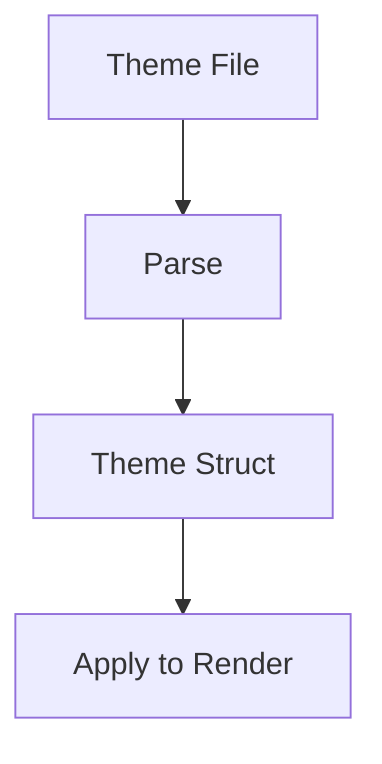

**Who should read:** Users wanting to customize output appearance.

---

### 5. [Output Formats](05-output-formats.md)

Explore the three output formats:

- SVG generation
- PNG rasterization
- PDF conversion
- Format-specific options

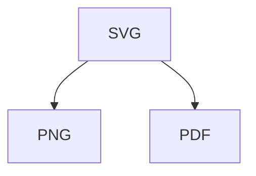

**Who should read:** Those needing specific output format details.

---

### 6. [Math Rendering](06-math-rendering.md)

Understand LaTeX math support:

- LaTeX to MathML conversion
- MathML parsing
- Layout calculation
- SVG generation

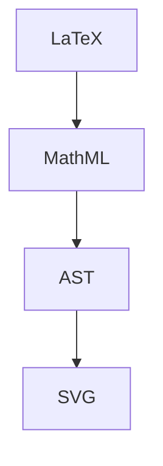

**Who should read:** Users including mathematical formulas in documents.

---

## Quick Navigation by Task

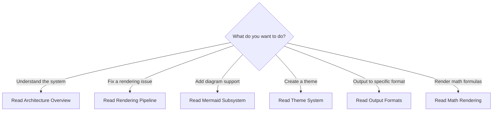

## Key Concepts Map

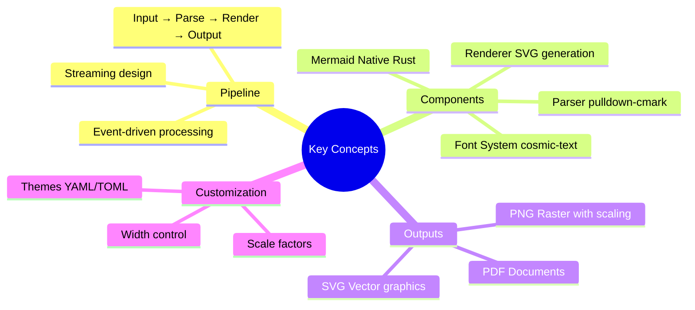

## Technology Stack

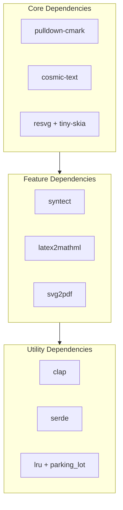

## Getting Started

1. **Read the Architecture Overview** to understand the big picture
2. **Explore specific topics** based on your needs
3. **Check the README** for usage examples

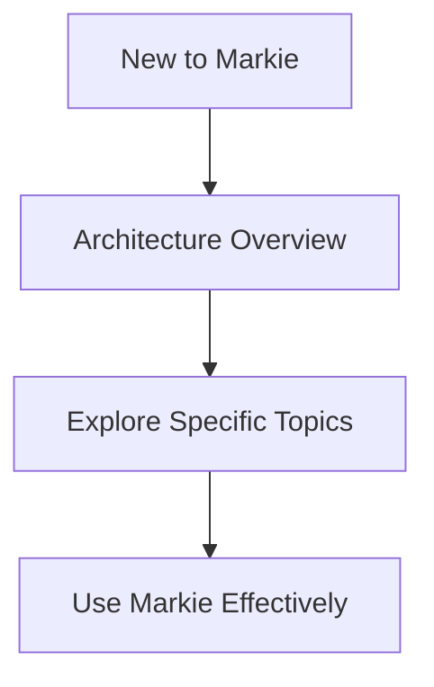

---

*Happy documenting with Markie!*
