# Markie Architecture Overview

> This document explains the overall architecture of Markie - a pure Rust Markdown to SVG/PNG/PDF renderer.

## What is Markie?

Markie is a command-line tool that converts Markdown documents into beautiful images. Think of it as a "Markdown printer" - you give it a text file written in Markdown, and it produces a visually formatted image.


## Core Value Proposition


## High-Level Architecture

Markie follows a **pipeline architecture** - data flows through a series of processing stages, each responsible for a specific transformation.

```mermaid
flowchart TB
    subgraph Input["📥 Input Stage"]
        MD[Markdown Text]
        THEME[Theme File]
    end
    
    subgraph Parsing["🔍 Parsing Stage"]
        PARSER[Markdown Parser]
        EVENTS[Event Stream]
    end
    
    subgraph Rendering["🎨 Rendering Stage"]
        RENDERER[SVG Renderer]
        FONTS[Font System]
        SYNTAX[Syntax Highlighter]
        MATH[Math Renderer]
        MERMAID[Mermaid Renderer]
    end
    
    subgraph Output["📤 Output Stage"]
        SVG[SVG String]
        PNG_CONVERT[PNG Converter]
        PDF_CONVERT[PDF Converter]
    end
    
    MD --> PARSER
    PARSER --> EVENTS
    EVENTS --> RENDERER
    THEME --> RENDERER
    RENDERER --> SVG
    SVG --> PNG_CONVERT
    SVG --> PDF_CONVERT
    FONTS --> RENDERER
    SYNTAX --> RENDERER
    MATH --> RENDERER
    MERMAID --> RENDERER
```



## Component Overview

### 1. Entry Point (`main.rs`)

The entry point handles command-line arguments and orchestrates the rendering pipeline.


### 2. Theme System (`theme.rs`)

The theme system controls all visual aspects of the output.


### 3. Font System (`fonts.rs`)

The font system provides text measurement capabilities with intelligent caching.


### 4. Core Renderer (`renderer.rs`)

The heart of Markie - processes Markdown events and generates SVG output.


### 5. Math Renderer (`math.rs`)

Converts LaTeX math expressions to SVG.


### 6. Mermaid Subsystem (`mermaid/`)

Native Rust implementation of Mermaid diagram rendering.


## Data Flow Summary


## Key Design Decisions

### 1. Pure Rust Implementation


### 2. Singleton Font System

The font system uses a global singleton with LRU caching to avoid expensive re-initialization:


### 3. Event-Driven Rendering

Markdown is processed as a stream of events rather than a full AST:

```mermaid
flowchart TB
    MD[Markdown] --> PARSER[Parser]
    PARSER --> E1[Event: Start Heading]
    PARSER --> E2[Event: Text "Hello"]
    PARSER --> E3[Event: End Heading]
    E1 --> RENDER[Renderer]
    E2 --> RENDER
    E3 --> RENDER
    RENDER --> SVG[SVG Output]
```

## File Structure Map


---

*Next: [Rendering Pipeline](02-rendering-pipeline.md)*
