# The Rendering Pipeline

> This document explains how Markdown text is transformed into visual SVG output.

## The Big Picture

The rendering pipeline is the heart of Markie. It takes Markdown text and produces SVG elements, handling everything from simple paragraphs to complex diagrams.

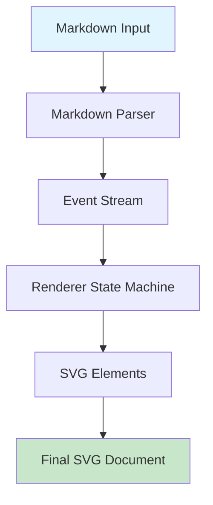
```mermaid
flowchart TB
    INPUT[Markdown Input] --> PARSE[Markdown Parser]
    PARSE --> EVENTS[Event Stream]
    EVENTS --> STATE[Renderer State Machine]
    STATE --> SVG[SVG Elements]
    SVG --> OUTPUT[Final SVG Document]
    
    style INPUT fill:#e1f5fe
    style OUTPUT fill:#c8e6c9
```

## Stage 1: Markdown Parsing

Markie uses `pulldown-cmark`, a pull-parser that generates events rather than building a complete AST.

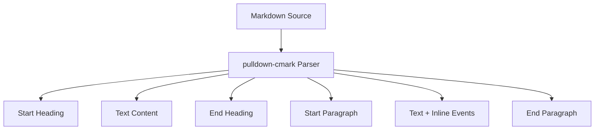
```mermaid
flowchart TB
    MD["Markdown Source"] --> P[pulldown-cmark Parser]
    P --> E1[Start Heading]
    P --> E2[Text Content]
    P --> E3[End Heading]
    P --> E4[Start Paragraph]
    P --> E5[Text + Inline Events]
    P --> E6[End Paragraph]
```

### Supported Markdown Features

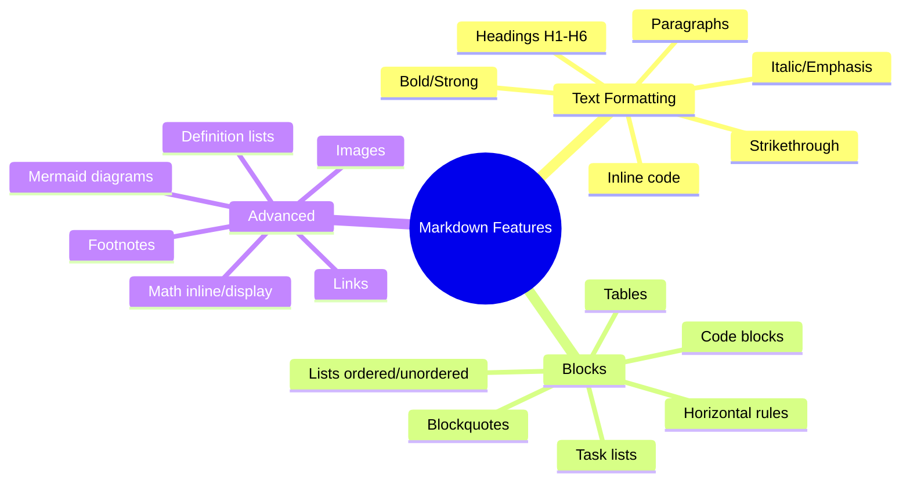
```mermaid
mindmap
  root((Markdown Features))
    Text Formatting
      Headings H1-H6
      Paragraphs
      Bold/Strong
      Italic/Emphasis
      Strikethrough
      Inline code
    Blocks
      Code blocks
      Blockquotes
      Lists ordered/unordered
      Task lists
      Tables
      Horizontal rules
    Advanced
      Links
      Images
      Footnotes
      Definition lists
      Math inline/display
      Mermaid diagrams
```

## Stage 2: The Renderer State Machine

The renderer maintains state as it processes events, tracking context like "are we in a list?" or "what's the current heading level?"

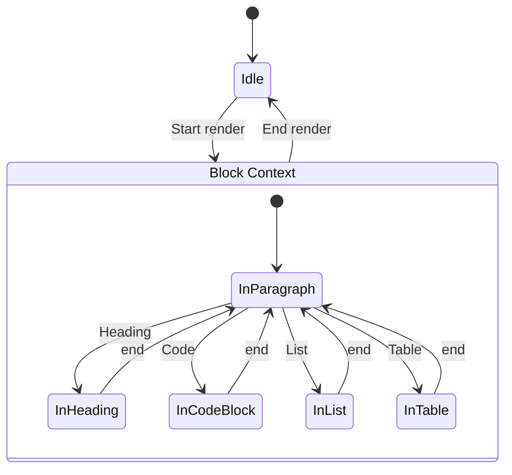
```mermaid
stateDiagram-v2
    [*] --> Idle
    
    state "Block Context" as BC {
        [*] --> InParagraph
        InParagraph --> InHeading : Heading
        InHeading --> InParagraph : end
        InParagraph --> InCodeBlock : Code
        InCodeBlock --> InParagraph : end
        InParagraph --> InList : List
        InList --> InParagraph : end
        InParagraph --> InTable : Table
        InTable --> InParagraph : end
    }
    
    Idle --> BC : Start render
    BC --> Idle : End render
```

### Renderer Internal State

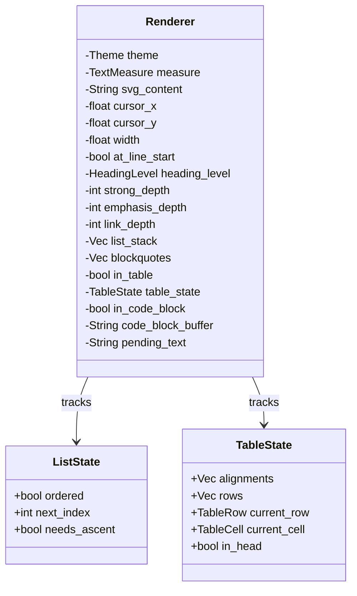
```mermaid
classDiagram
    class Renderer {
        -Theme theme
        -TextMeasure measure
        -String svg_content
        -float cursor_x
        -float cursor_y
        -float width
        -bool at_line_start
        -HeadingLevel heading_level
        -int strong_depth
        -int emphasis_depth
        -int link_depth
        -Vec list_stack
        -Vec blockquotes
        -bool in_table
        -TableState table_state
        -bool in_code_block
        -String code_block_buffer
        -String pending_text
    }
    
    class ListState {
        +bool ordered
        +int next_index
        +bool needs_ascent
    }
    
    class TableState {
        +Vec alignments
        +Vec rows
        +TableRow current_row
        +TableCell current_cell
        +bool in_head
    }
    
    Renderer --> ListState : tracks
    Renderer --> TableState : tracks
```

## Stage 3: Event Processing Flow

Each event type is handled by a specific method in the renderer:

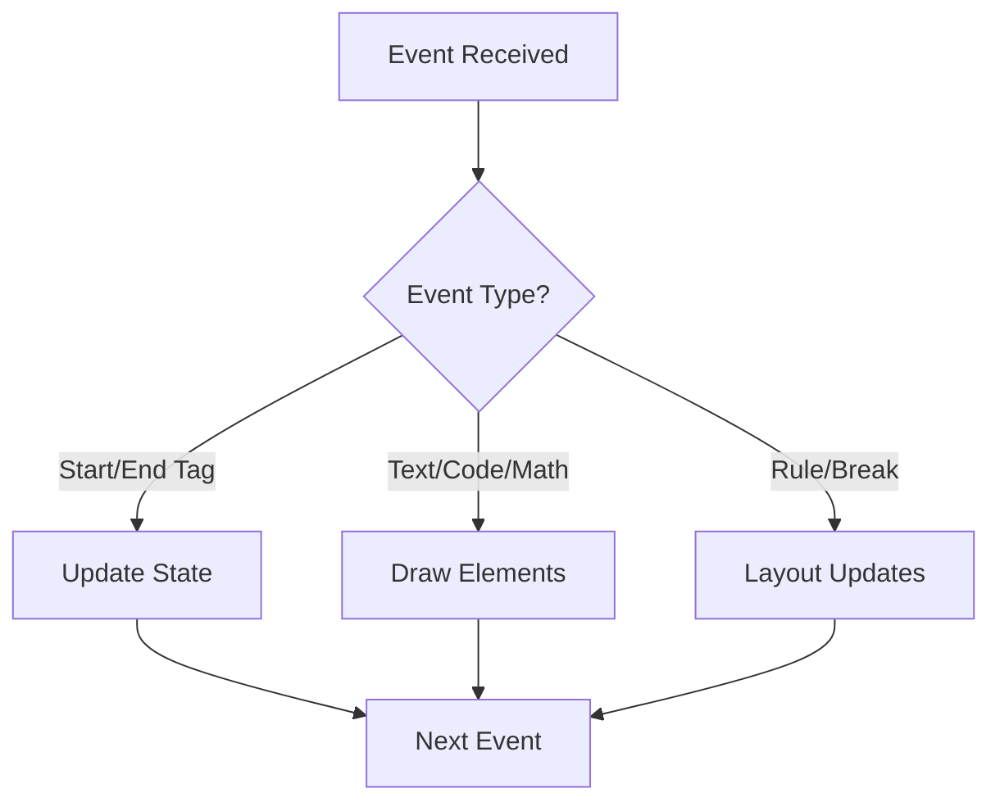
```mermaid
flowchart TB
    EVENT[Event Received] --> TYPE{Event Type?}
    
    TYPE -->|Start/End Tag| UPDATE[Update State]
    TYPE -->|Text/Code/Math| DRAW[Draw Elements]
    TYPE -->|Rule/Break| MISC[Layout Updates]
    
    UPDATE --> NEXT[Next Event]
    DRAW --> NEXT
    MISC --> NEXT
```

### Start Tag Handling

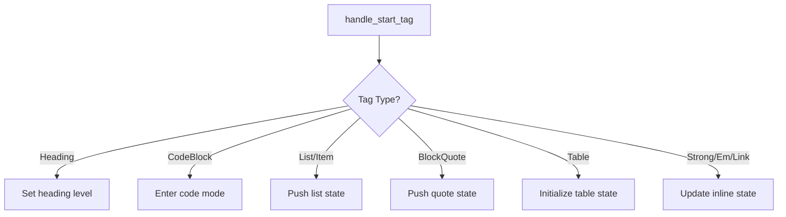
```mermaid
flowchart TD
    START[handle_start_tag] --> TAG{Tag Type?}
    
    TAG -->|Heading| H[Set heading level]
    TAG -->|CodeBlock| CB[Enter code mode]
    TAG -->|List/Item| L[Push list state]
    TAG -->|BlockQuote| BQ[Push quote state]
    TAG -->|Table| T[Initialize table state]
    TAG -->|Strong/Em/Link| S[Update inline state]
```

### End Tag Handling

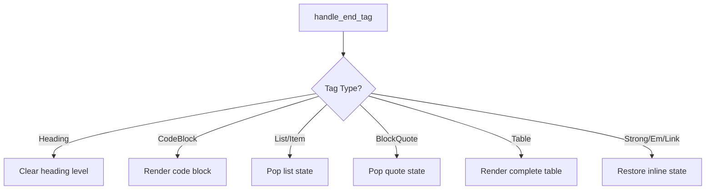
```mermaid
flowchart TD
    END[handle_end_tag] --> TAG{Tag Type?}
    
    TAG -->|Heading| H[Clear heading level]
    TAG -->|CodeBlock| CB[Render code block]
    TAG -->|List/Item| L[Pop list state]
    TAG -->|BlockQuote| BQ[Pop quote state]
    TAG -->|Table| T[Render complete table]
    TAG -->|Strong/Em/Link| S[Restore inline state]
```

## Stage 4: Text Rendering

Text rendering is the core operation - it places characters at the correct positions.

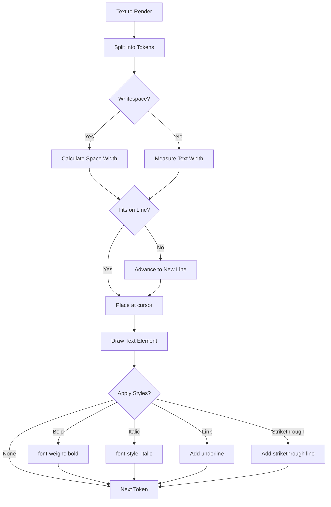
```mermaid
flowchart TB
    TEXT[Text to Render] --> SPLIT[Split into Tokens]
    SPLIT --> WS{Whitespace?}
    
    WS -->|Yes| SPACE[Calculate Space Width]
    WS -->|No| MEASURE[Measure Text Width]
    
    SPACE --> FIT{Fits on Line?}
    MEASURE --> FIT
    
    FIT -->|Yes| PLACE[Place at cursor]
    FIT -->|No| NEWLINE[Advance to New Line]
    
    NEWLINE --> PLACE
    PLACE --> DRAW_TEXT[Draw Text Element]
    DRAW_TEXT --> STYLE{Apply Styles?}
    
    STYLE -->|Bold| BOLD[font-weight: bold]
    STYLE -->|Italic| ITALIC[font-style: italic]
    STYLE -->|Link| UNDERLINE[Add underline]
    STYLE -->|Strikethrough| STRIKE[Add strikethrough line]
    STYLE -->|None| NEXT_TOKEN[Next Token]
    
    BOLD --> NEXT_TOKEN
    ITALIC --> NEXT_TOKEN
    UNDERLINE --> NEXT_TOKEN
    STRIKE --> NEXT_TOKEN
```

### Text Measurement Process

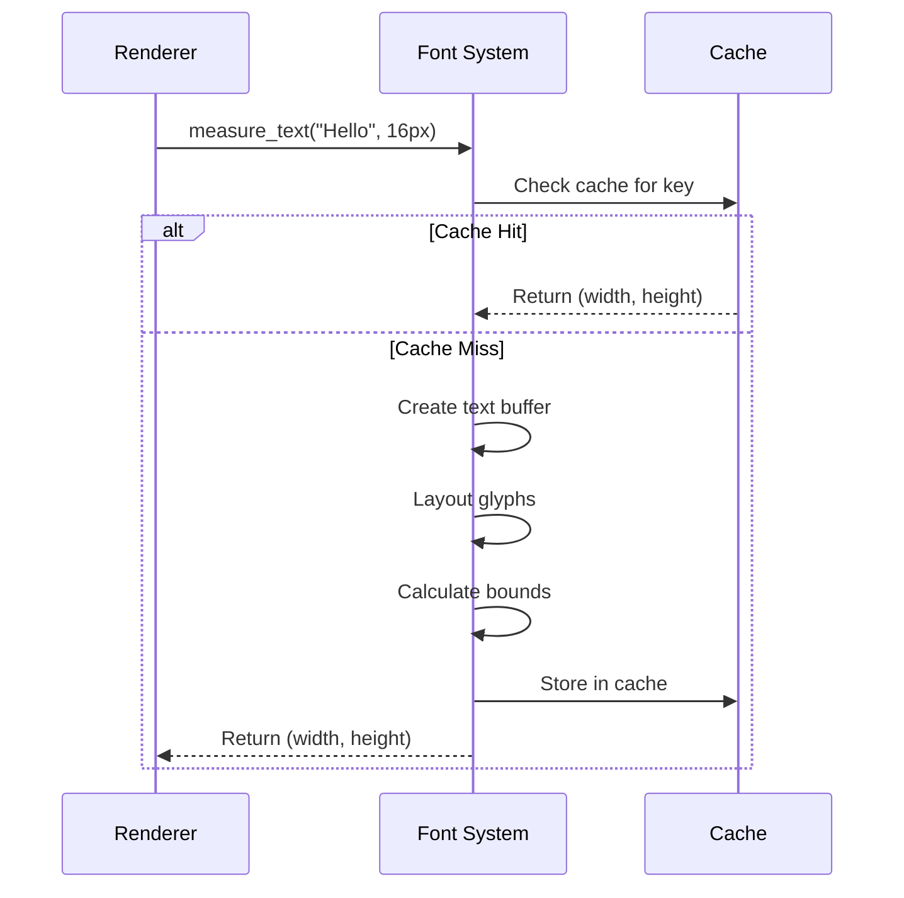
```mermaid
sequenceDiagram
    participant R as Renderer
    participant F as Font System
    participant C as Cache
    
    R->>F: measure_text("Hello", 16px)
    F->>C: Check cache for key
    alt Cache Hit
        C-->>F: Return (width, height)
    else Cache Miss
        F->>F: Create text buffer
        F->>F: Layout glyphs
        F->>F: Calculate bounds
        F->>C: Store in cache
        F-->>R: Return (width, height)
    end
```

## Stage 5: Special Block Rendering

### Code Block Rendering

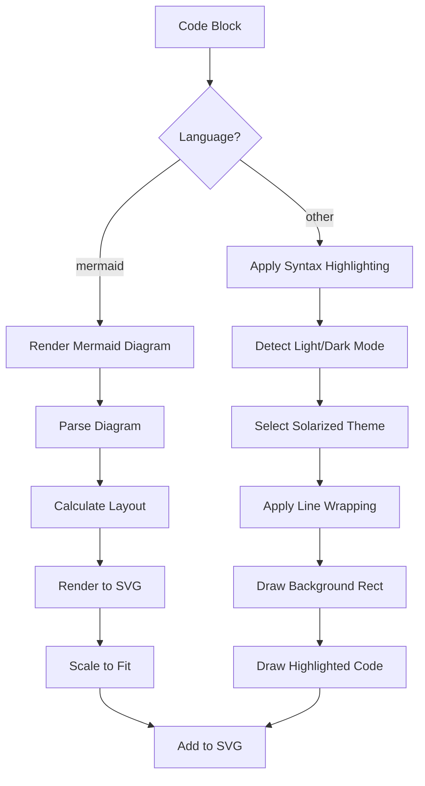
```mermaid
flowchart TB
    CB[Code Block] --> LANG{Language?}
    
    LANG -->|mermaid| MERMAID[Render Mermaid Diagram]
    LANG -->|other| HIGHLIGHT[Apply Syntax Highlighting]
    
    MERMAID --> M_PARSE[Parse Diagram]
    M_PARSE --> M_LAYOUT[Calculate Layout]
    M_LAYOUT --> M_RENDER[Render to SVG]
    M_RENDER --> M_SCALE[Scale to Fit]
    M_SCALE --> OUTPUT
    
    HIGHLIGHT --> DETECT[Detect Light/Dark Mode]
    DETECT --> THEME[Select Solarized Theme]
    THEME --> WRAP[Apply Line Wrapping]
    WRAP --> DRAW_BG[Draw Background Rect]
    DRAW_BG --> DRAW_CODE[Draw Highlighted Code]
    DRAW_CODE --> OUTPUT[Add to SVG]
```

### Table Rendering

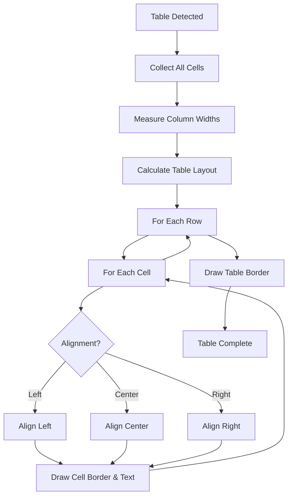
```mermaid
flowchart TB
    TABLE[Table Detected] --> COLLECT[Collect All Cells]
    COLLECT --> MEASURE[Measure Column Widths]
    MEASURE --> CALC[Calculate Table Layout]
    
    CALC --> ROWS[For Each Row]
    ROWS --> CELLS[For Each Cell]
    CELLS --> ALIGN{Alignment?}
    
    ALIGN -->|Left| L[Align Left]
    ALIGN -->|Center| C[Align Center]
    ALIGN -->|Right| R[Align Right]
    
    L --> DRAW_CELL
    C --> DRAW_CELL
    R --> DRAW_CELL
    
    DRAW_CELL[Draw Cell Border & Text] --> CELLS
    CELLS --> ROWS
    ROWS --> FINALIZE[Draw Table Border]
    FINALIZE --> DONE[Table Complete]
```

### Image Rendering

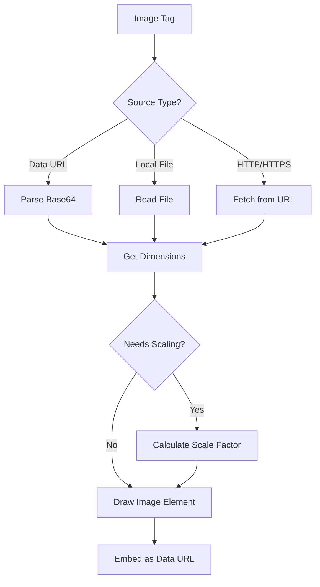
```mermaid
flowchart TB
    IMG[Image Tag] --> SRC{Source Type?}
    
    SRC -->|Data URL| DATA[Parse Base64]
    SRC -->|Local File| LOCAL[Read File]
    SRC -->|HTTP/HTTPS| REMOTE[Fetch from URL]
    
    DATA --> DIMS[Get Dimensions]
    LOCAL --> DIMS
    REMOTE --> DIMS
    
    DIMS --> SCALE{Needs Scaling?}
    SCALE -->|Yes| CALC_SCALE[Calculate Scale Factor]
    SCALE -->|No| DRAW
    CALC_SCALE --> DRAW[Draw Image Element]
    DRAW --> EMBED[Embed as Data URL]
```

## Stage 6: Cursor and Layout Management

The renderer maintains a virtual cursor that tracks the current drawing position.

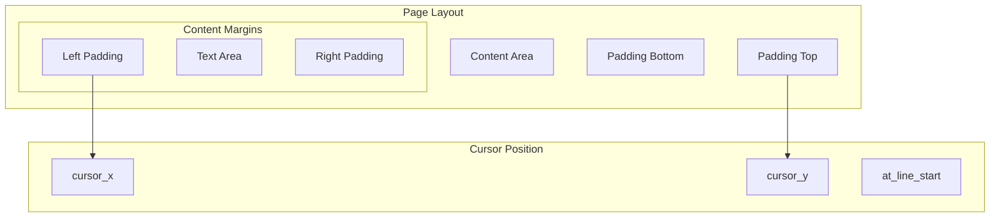
```mermaid
flowchart TB
    subgraph Layout["Page Layout"]
        direction TB
        PAD_Y[Padding Top]
        CONTENT[Content Area]
        PAD_Y2[Padding Bottom]
        
        subgraph Margins["Content Margins"]
            PAD_X[Left Padding]
            TEXT_AREA[Text Area]
            PAD_X2[Right Padding]
        end
    end
    
    subgraph Cursor["Cursor Position"]
        X[cursor_x]
        Y[cursor_y]
        LINE[at_line_start]
    end
    
    PAD_Y --> Y
    PAD_X --> X
```

### Line Breaking Logic

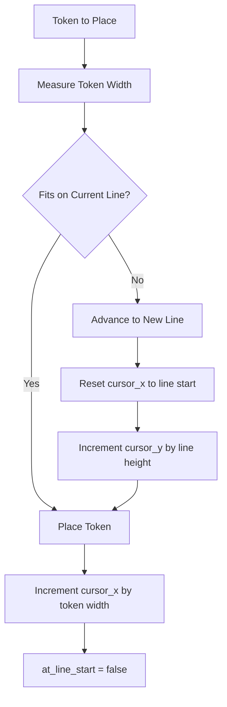
```mermaid
flowchart TD
    TOKEN[Token to Place] --> MEASURE_T[Measure Token Width]
    MEASURE_T --> CHECK{Fits on Current Line?}
    
    CHECK -->|Yes| PLACE[Place Token]
    CHECK -->|No| ADVANCE[Advance to New Line]
    
    ADVANCE --> RESET_X[Reset cursor_x to line start]
    RESET_X --> INC_Y[Increment cursor_y by line height]
    INC_Y --> PLACE
    
    PLACE --> UPDATE_X[Increment cursor_x by token width]
    UPDATE_X --> SET_FALSE[at_line_start = false]
```

### Margin and Spacing

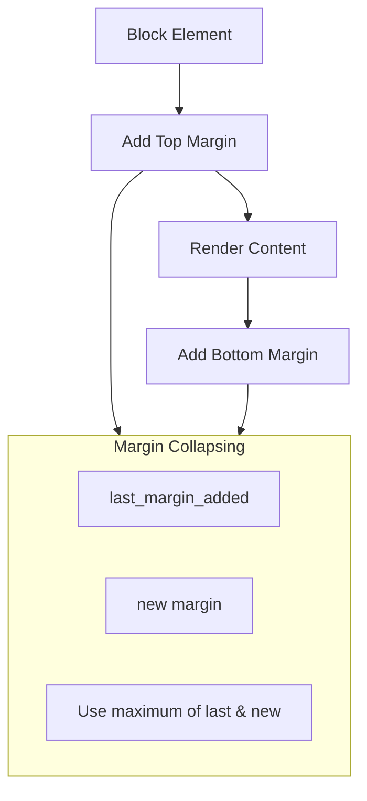
```mermaid
flowchart TB
    BLOCK[Block Element] --> BEFORE[Add Top Margin]
    BEFORE --> CONTENT[Render Content]
    CONTENT --> AFTER[Add Bottom Margin]
    
    subgraph MarginLogic["Margin Collapsing"]
        LAST[last_margin_added]
        NEW[new margin]
        MAX[Use maximum of last & new]
    end
    
    BEFORE --> MarginLogic
    AFTER --> MarginLogic
```

## Stage 7: SVG Generation

The final stage assembles all elements into a complete SVG document.

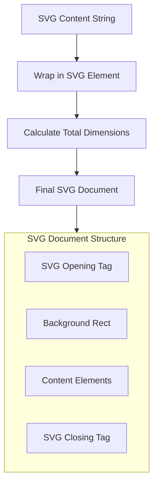
```mermaid
flowchart TB
    CONTENT[SVG Content String] --> WRAP[Wrap in SVG Element]
    WRAP --> DIMS[Calculate Total Dimensions]
    DIMS --> FINAL[Final SVG Document]
    
    subgraph SVGStructure["SVG Document Structure"]
        HEADER[SVG Opening Tag]
        BG[Background Rect]
        BODY[Content Elements]
        CLOSE[SVG Closing Tag]
    end
    
    FINAL --> SVGStructure
```

### SVG Element Types Generated

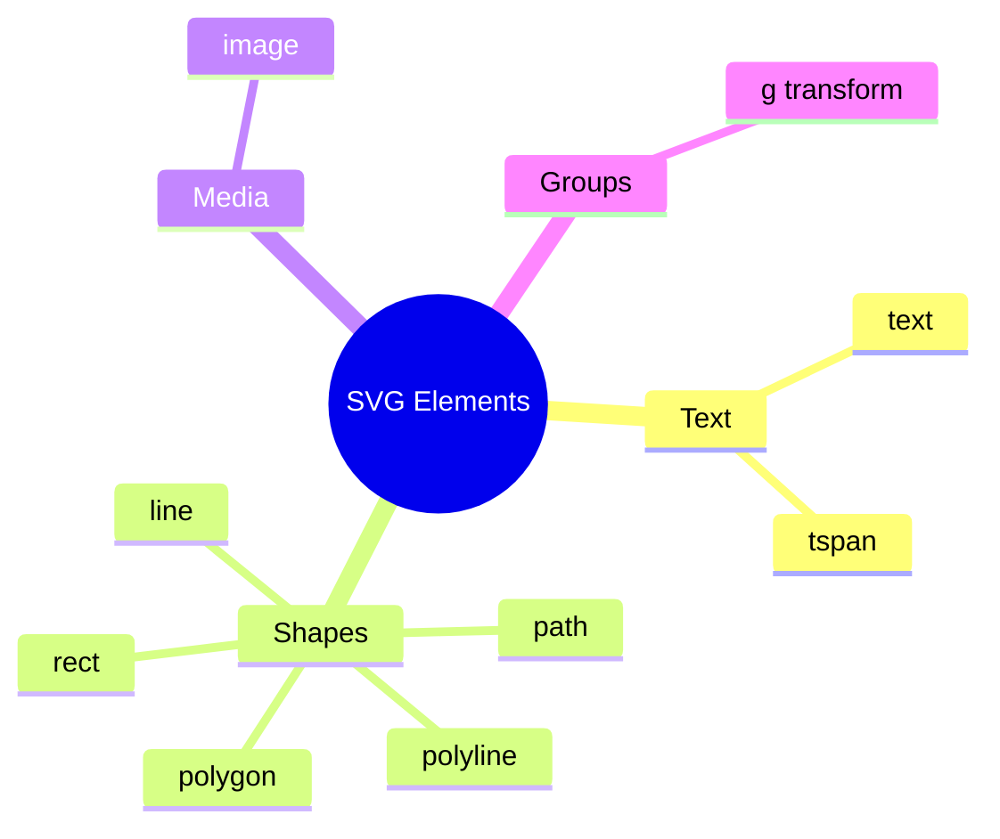
```mermaid
mindmap
  root((SVG Elements))
    Text
      text
      tspan
    Shapes
      rect
      line
      path
      polygon
      polyline
    Media
      image
    Groups
      g transform
```

## Complete Processing Example

Let's trace through a complete example:

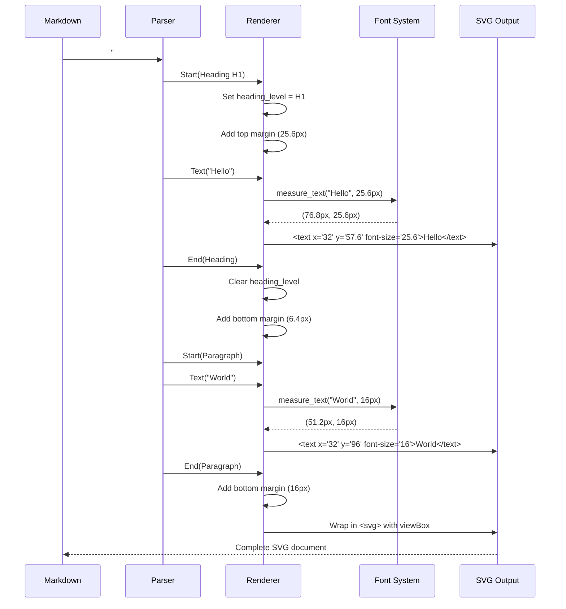
```mermaid
sequenceDiagram
    participant MD as Markdown
    participant P as Parser
    participant R as Renderer
    participant F as Font System
    participant SVG as SVG Output
    
    MD->>P: "# Hello\n\nWorld"
    
    P->>R: Start(Heading H1)
    R->>R: Set heading_level = H1
    R->>R: Add top margin (25.6px)
    
    P->>R: Text("Hello")
    R->>F: measure_text("Hello", 25.6px)
    F-->>R: (76.8px, 25.6px)
    R->>SVG: <text x="32" y="57.6" font-size="25.6">Hello</text>
    
    P->>R: End(Heading)
    R->>R: Clear heading_level
    R->>R: Add bottom margin (6.4px)
    
    P->>R: Start(Paragraph)
    
    P->>R: Text("World")
    R->>F: measure_text("World", 16px)
    F-->>R: (51.2px, 16px)
    R->>SVG: <text x="32" y="96" font-size="16">World</text>
    
    P->>R: End(Paragraph)
    R->>R: Add bottom margin (16px)
    
    R->>SVG: Wrap in <svg> with viewBox
    SVG-->>MD: Complete SVG document
```

## Error Handling

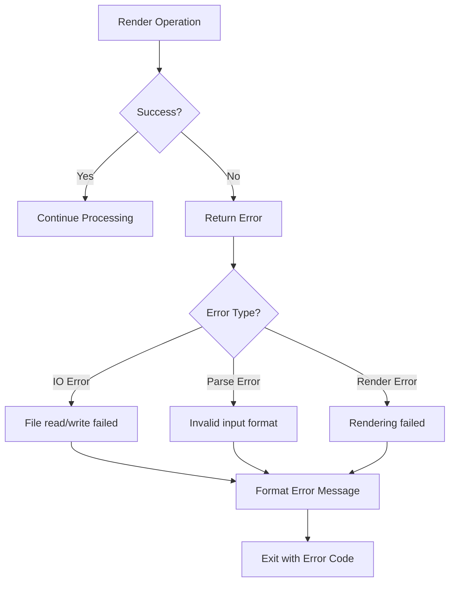
```mermaid
flowchart TB
    OPERATION[Render Operation] --> RESULT{Success?}
    
    RESULT -->|Yes| CONTINUE[Continue Processing]
    RESULT -->|No| ERROR[Return Error]
    
    ERROR --> TYPE{Error Type?}
    TYPE -->|IO Error| IO[File read/write failed]
    TYPE -->|Parse Error| PARSE[Invalid input format]
    TYPE -->|Render Error| RENDER[Rendering failed]
    
    IO --> MSG[Format Error Message]
    PARSE --> MSG
    RENDER --> MSG
    MSG --> EXIT[Exit with Error Code]
```

---

*Previous: [Architecture Overview](01-architecture-overview.md)*
*Next: [Mermaid Subsystem](03-mermaid-subsystem.md)*
