# The Mermaid Subsystem

> This document explains how Markie natively renders Mermaid diagrams without any JavaScript runtime.

## What is Mermaid?

Mermaid is a text-based diagramming syntax. Instead of drawing diagrams with a mouse, you write them as code. Markie implements a pure Rust parser and renderer for Mermaid diagrams.

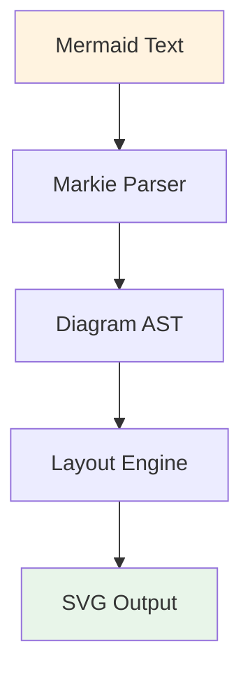

## Supported Diagram Types

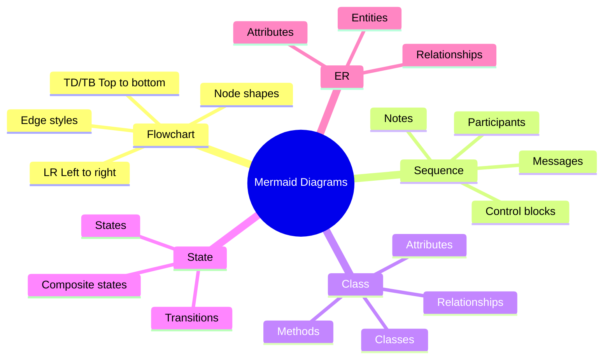

## Architecture Overview

The Mermaid subsystem is organized into four main modules:

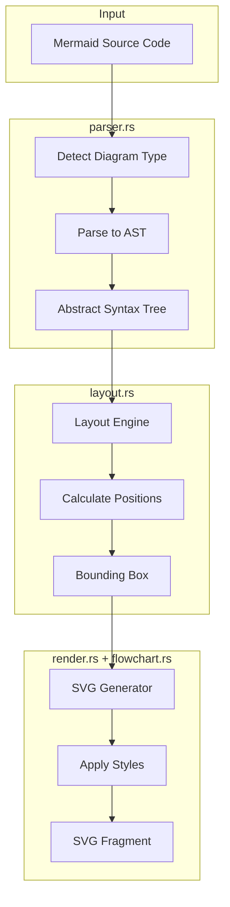

## Stage 1: Parsing (parser.rs)

The parser converts Mermaid text into structured data.

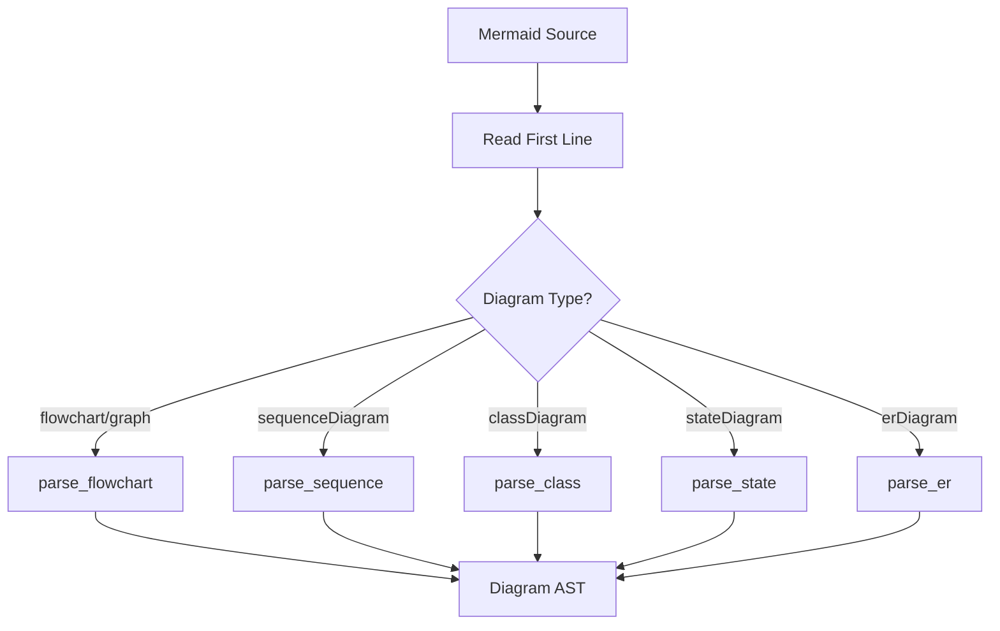

### Flowchart Parsing

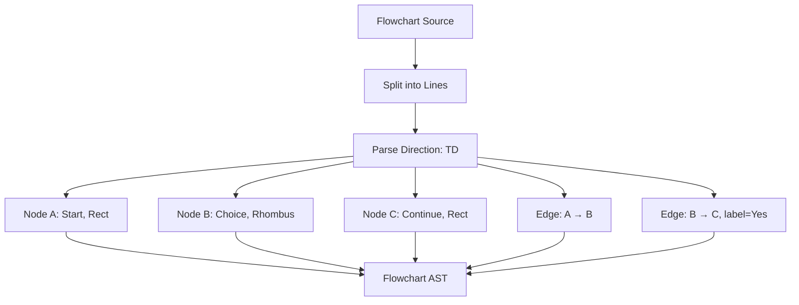

### Node Shape Detection

```mermaid
flowchart TB
    NODE["A[Label]" or "A(Label)" or "A{Label}"]
    
    NODE --> PATTERN{Match Pattern}
    
    PATTERN -->|"A[Label]"| RECT[Rect Shape]
    PATTERN -->|"A(Label)"| ROUNDED[Rounded Rect]
    PATTERN -->|"A{Label}"| RHOMBUS[Rhombus/Diamond]
    PATTERN -->|"A((Label))"| CIRCLE[Circle]
    PATTERN -->|"A[[Label]]"| SUBROUTINE[Subroutine]
    PATTERN -->|"A[(Label)]"| CYLINDER[Cylinder]
    PATTERN -->|"A([Label])"| STADIUM[Stadium]
    PATTERN -->|"A[/Label/]"| PARA[Parallelogram]
    PATTERN -->|"A{{Label}}"| HEX[Hexagon]
    
    RECT --> RESULT[NodeInfo]
    ROUNDED --> RESULT
    RHOMBUS --> RESULT
    CIRCLE --> RESULT
    SUBROUTINE --> RESULT
    CYLINDER --> RESULT
    STADIUM --> RESULT
    PARA --> RESULT
    HEX --> RESULT
```

### Edge Style Detection

```mermaid
flowchart TB
    EDGE["A --> B" or "A -.-> B" or "A ==> B"]
    
    EDGE --> PATTERNS{Match Pattern}
    
    PATTERNS -->|"-->"| SOLID[Solid Arrow]
    PATTERNS -->|"---"| LINE[Solid Line]
    PATTERNS -->|"-.->"| DOTTED[Dotted Arrow]
    PATTERNS -->|"-.-"| DOT_LINE[Dotted Line]
    PATTERNS -->|"==>"| THICK[Thick Arrow]
    PATTERNS -->|"==="<| THICK_REV[Thick Arrow Reverse]
    PATTERNS -->|"--o"| CIRCLE[Circle End]
    PATTERNS -->|"--x"| CROSS[Cross End]
    PATTERNS -->|"<-->"| BIDI[Bidirectional]
    
    SOLID --> STYLE[EdgeStyle]
    LINE --> STYLE
    DOTTED --> STYLE
    DOT_LINE --> STYLE
    THICK --> STYLE
    THICK_REV --> STYLE
    CIRCLE --> STYLE
    CROSS --> STYLE
    BIDI --> STYLE
```

### Sequence Diagram Parsing

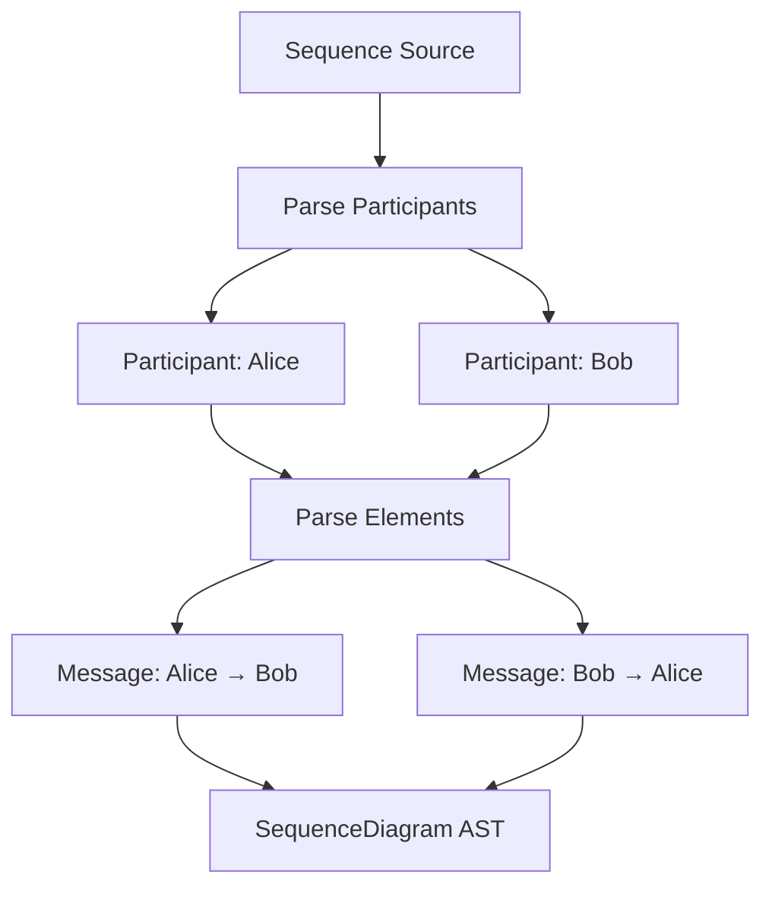

### Control Block Parsing

Sequence diagrams support nested control structures:

```mermaid
flowchart TB
    BLOCK["Control Block Source"]
    
    BLOCK --> TYPE_BLOCK[Detect Block Type: loop]
    TYPE_BLOCK --> LABEL[Extract Label: "Every minute"]
    LABEL --> CHILDREN[Parse Child Elements Recursively]
    
    CHILDREN --> C1[Message: A → B "Ping"]
    CHILDREN --> C2[Message: B → A "Pong"]
    
    C1 --> BLOCK_AST[SequenceBlock]
    C2 --> BLOCK_AST
```

### Supported Control Blocks

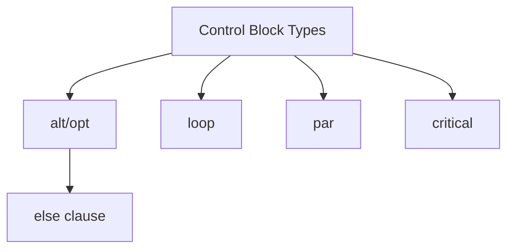

## Stage 2: Layout (layout.rs)

The layout engine calculates positions for all diagram elements.

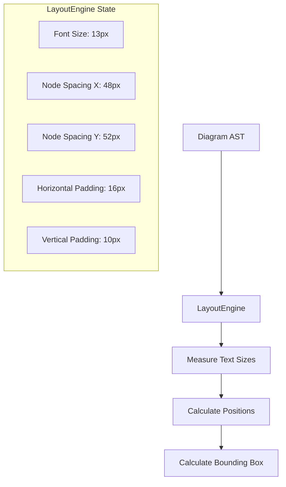

### Flowchart Layout Algorithm

The flowchart uses a layered (hierarchical) layout:

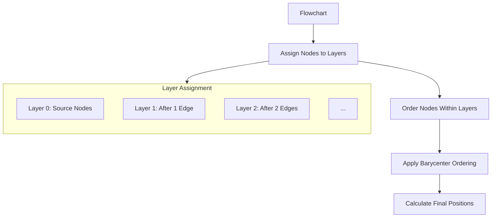

### Layer Assignment Process

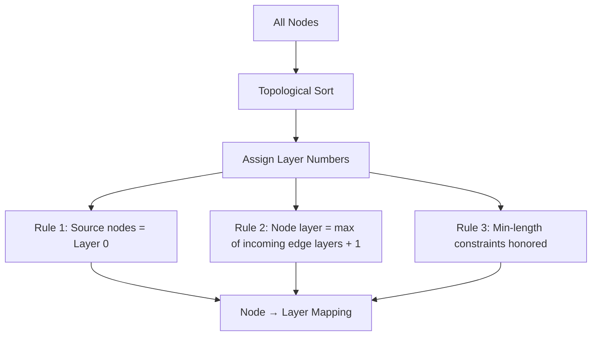

### Barycenter Ordering

To reduce edge crossings, nodes are ordered using the barycenter heuristic:

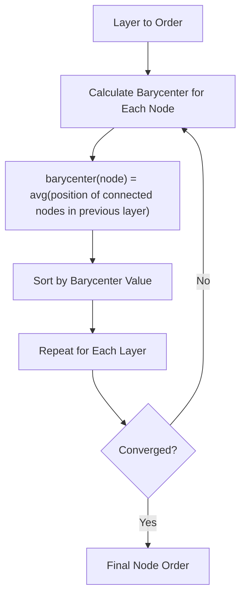

### Sequence Diagram Layout

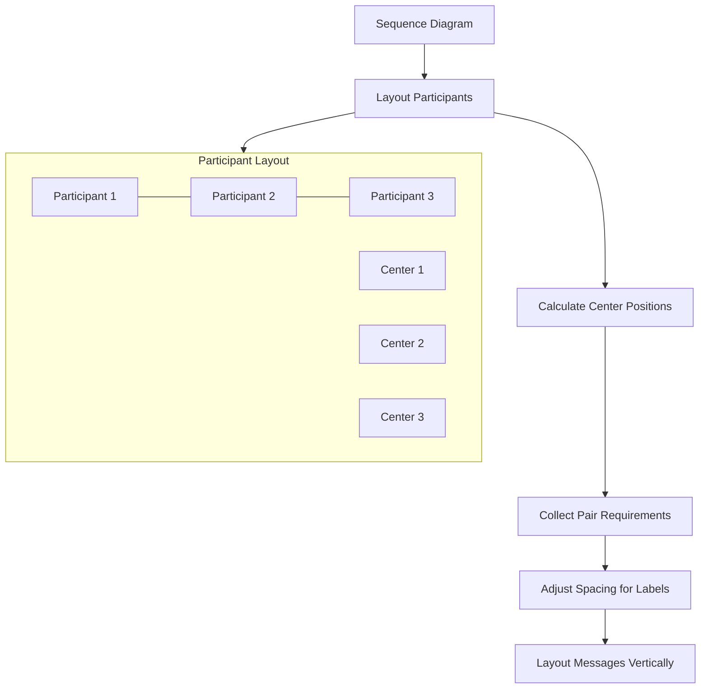

### Class Diagram Layout

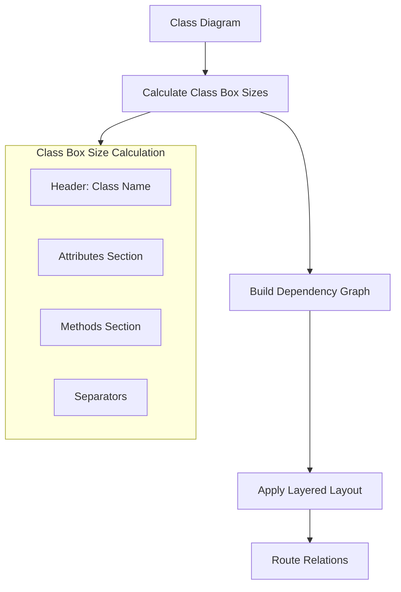

## Stage 3: Rendering (render.rs + flowchart.rs)

The renderer converts positioned elements to SVG.

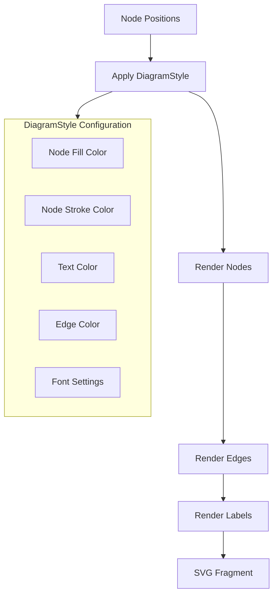

### Flowchart Node Rendering

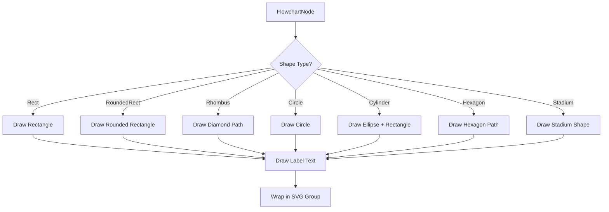

### Edge Path Calculation

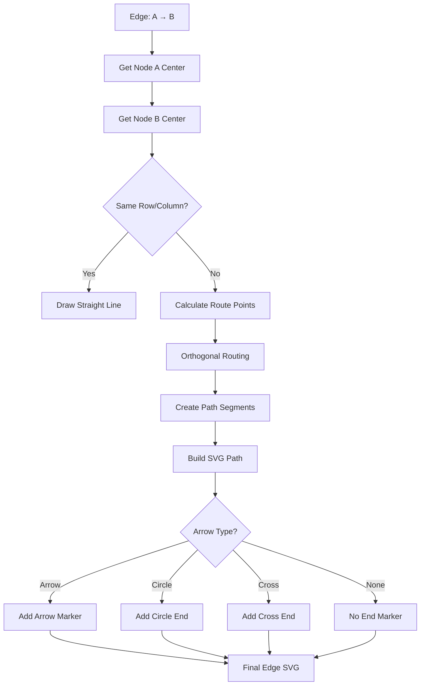

### Edge Label Placement

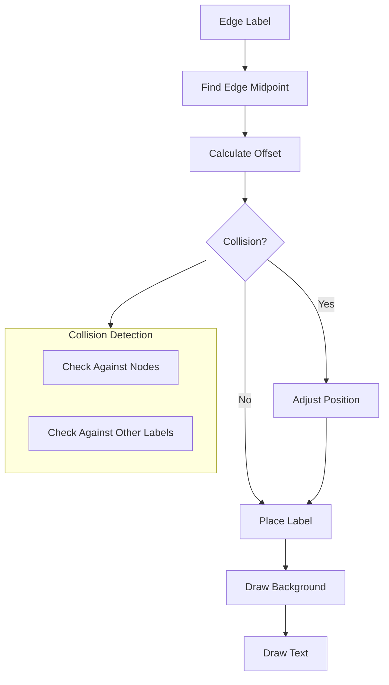

### Sequence Diagram Rendering

```mermaid
flowchart TB
    SEQ[Sequence Diagram] --> PART[Render Participants]
    PART --> LIFELINE[Draw Lifelines]
    LIFELINE --> MESSAGES[Render Messages]
    MESSAGES --> BLOCKS[Render Control Blocks]
    
    subgraph ParticipantBox["Participant Box"]
        RECT[Rectangle Box]
        NAME[Participant Name]
    end
    
    PART --> ParticipantBox
    
    subgraph MessageLine["Message Line"]
        ARROW[Arrow Type]
        LABEL_MSG[Message Label]
        DASHED[Dotted for Reply]
    end
    
    MESSAGES --> MessageLine
```

### Control Block Rendering

```mermaid
flowchart TB
    BLOCK[Sequence Block] --> RECT_B[Draw Bounding Rectangle]
    RECT_B --> TITLE[Render Block Title]
    TITLE --> CONTENTS[Render Contents]
    
    BLOCK --> ELSE{Has Else Branch?}
    ELSE -->|Yes| SEPARATOR[Draw Dashed Separator]
    SEPARATOR --> ELSE_CONTENT[Render Else Contents]
    
    ELSE_CONTENT --> NESTED{Nested Blocks?}
    CONTENTS --> NESTED
    
    NESTED -->|Yes| RECURSE[Recursively Render]
    NESTED -->|No| DONE[Block Complete]
    RECURSE --> DONE
```

## Diagram Style System

Colors are automatically derived from the theme:

```mermaid
flowchart TB
    THEME[Theme Colors] --> CONTRAST[Calculate Contrast]
    CONTRAST --> MIX[Mix Colors]
    MIX --> STYLE[DiagramStyle]
    
    subgraph ColorDerivation["Color Derivation"]
        BG[Background Color]
        TEXT[Text Color]
        CODE[Code Background]
        
        BG --> NODE_FILL[Node Fill: Mix 3%]
        CODE --> NODE_STROKE[Node Stroke: Mix 20%]
        CODE --> EDGE_COLOR[Edge Color: Mix 30%]
        CODE --> LABEL_COLOR[Label Color: Mix 60%]
    end
    
    THEME --> ColorDerivation
```

## Complete Example: Flowchart

Let's trace through rendering a complete flowchart:

```mermaid
sequenceDiagram
    participant SRC as Source
    participant P as Parser
    participant L as Layout
    participant R as Renderer
    participant SVG as SVG Output
    
    SRC->>P: flowchart TD; A[Start] --> B{Choice}; B --> C[End]
    
    Note over P: Parse direction: TopDown
    Note over P: Parse node A: label="Start", shape=Rect
    Note over P: Parse node B: label="Choice", shape=Rhombus
    Note over P: Parse node C: label="End", shape=Rect
    Note over P: Parse edge A → B
    Note over P: Parse edge B → C
    
    P->>L: Flowchart AST
    
    Note over L: Assign layers: A=0, B=1, C=2
    Note over L: Calculate node sizes
    Note over L: Position nodes vertically
    
    L->>R: Positions & Bounding Box
    
    Note over R: Draw node A rect at (50, 20)
    Note over R: Draw node B diamond at (50, 100)
    Note over R: Draw node C rect at (50, 180)
    Note over R: Draw edge A → B
    Note over R: Draw edge B → C
    Note over R: Draw labels "Start", "Choice", "End"
    
    R->>SVG: SVG Fragment
    
    Note over SVG: <g><rect...><path...><text...></g>
```

## Error Handling

```mermaid
flowchart TB
    PARSE[Parse Operation] --> VALID{Valid Syntax?}
    
    VALID -->|Yes| CONTINUE[Continue Processing]
    VALID -->|No| ERROR[Parse Error]
    
    ERROR --> TYPE{Error Type}
    TYPE -->|Unknown Diagram| UNKNOWN["Unknown diagram type"]
    TYPE -->|Invalid Syntax| INVALID["Invalid syntax: ..."]
    TYPE -->|Missing Element| MISSING["Missing required element"]
    
    UNKNOWN --> FALLBACK[Fallback to Flowchart]
    INVALID --> MSG[Return Error Message]
    MISSING --> MSG
    
    FALLBACK --> CONTINUE
```

## Performance Considerations

```mermaid
flowchart TB
    DIAGRAM[Diagram] --> COMPLEXITY{Complexity}
    
    COMPLEXITY -->|Simple| FAST[Fast Path]
    COMPLEXITY -->|Medium| NORMAL[Normal Path]
    COMPLEXITY -->|Complex| OPTIMIZE[Optimized Path]
    
    subgraph Optimizations["Optimizations Applied"]
        CACHE[Text Measurement Caching]
        SPARSE[Sparse Node Spacing]
        COLLISION[Collision-Aware Labels]
    end
    
    NORMAL --> Optimizations
    OPTIMIZE --> Optimizations
```

---

*Previous: [Rendering Pipeline](02-rendering-pipeline.md)*
*Next: [Theme System](04-theme-system.md)*
