# The Theme System

> This document explains how Markie handles visual styling through its theme system.

## What is a Theme?

A theme is a collection of visual properties that control how your Markdown document looks when rendered. Think of it as a "color scheme" or "style preset" that affects colors, fonts, and spacing.

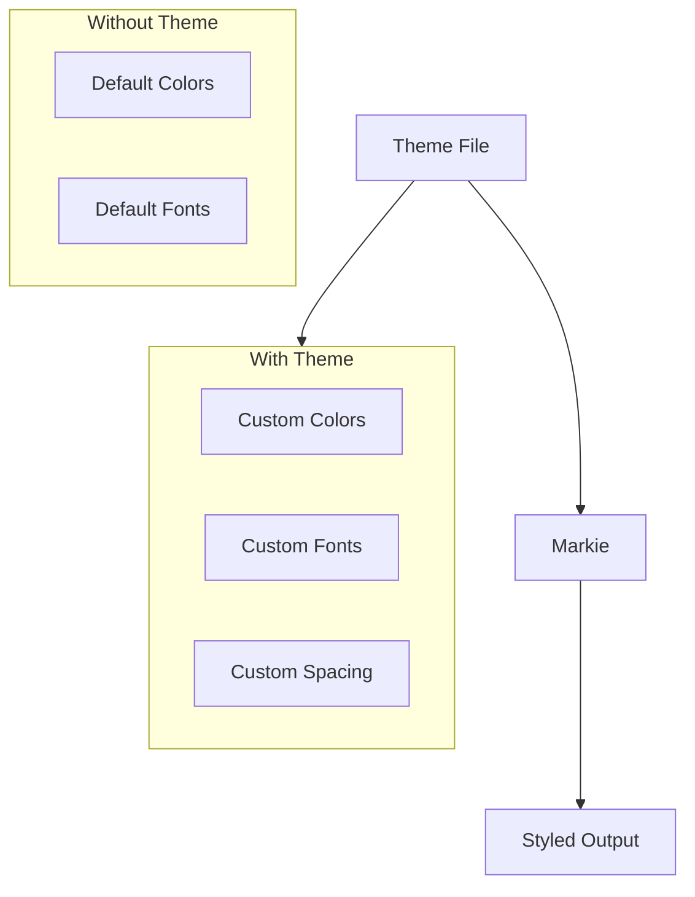

## Theme Properties

The theme controls every visual aspect of the output:

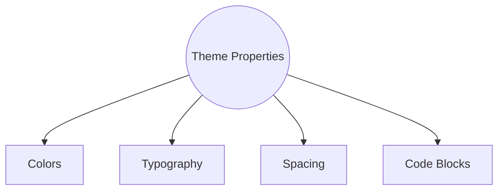

## Default Theme: GitHub Light

Markie ships with a default theme inspired by GitHub's light mode:

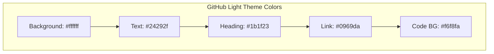

## Theme File Formats

Markie supports Alacritty theme files in both YAML and TOML formats:

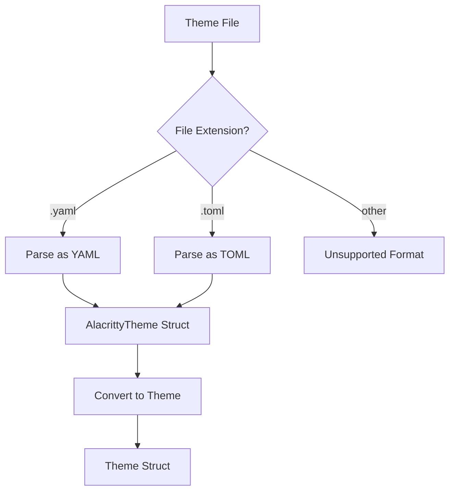

### TOML Format Example

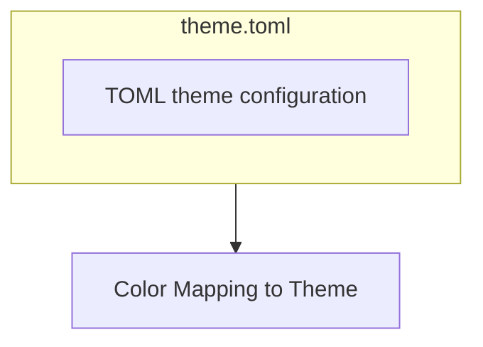

### YAML Format Example

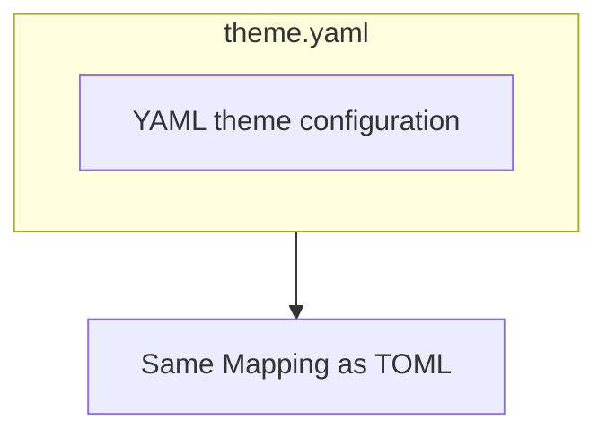

## Color Mapping Logic

Alacritty themes don't have all the colors Markie needs, so we map them intelligently:

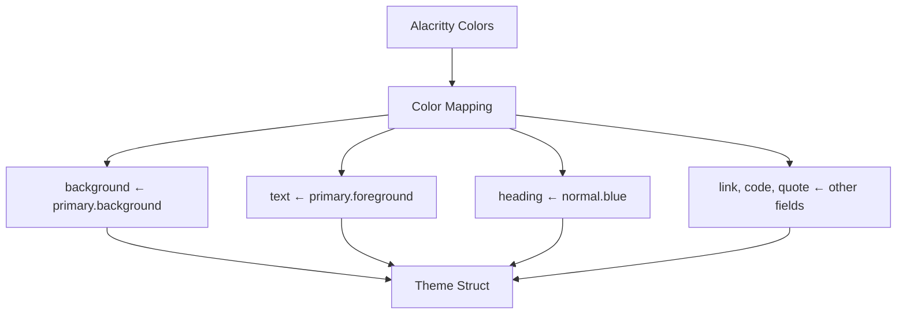

## Theme Loading Process

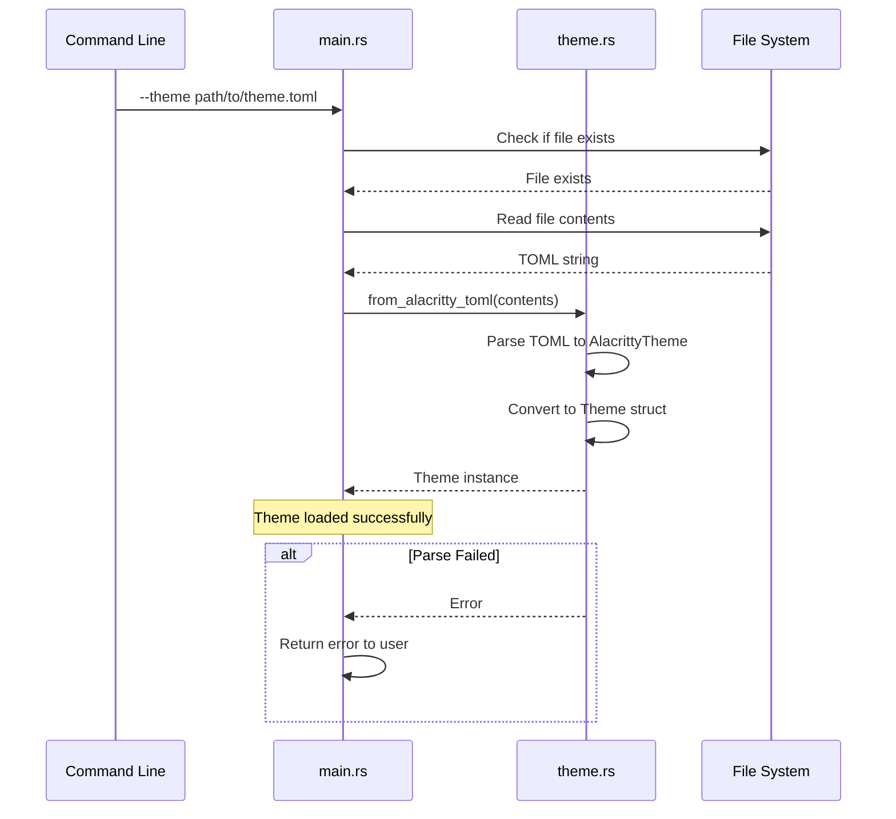

## Theme Application

Once loaded, the theme is used throughout the rendering process:

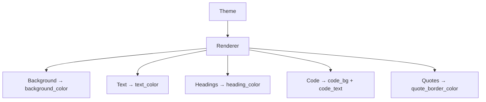

### Color Usage by Element

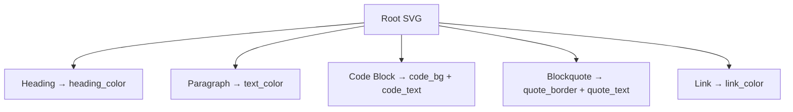

## Typography Settings

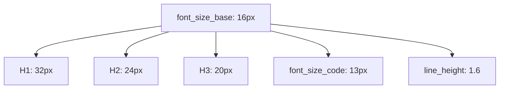

## Spacing System

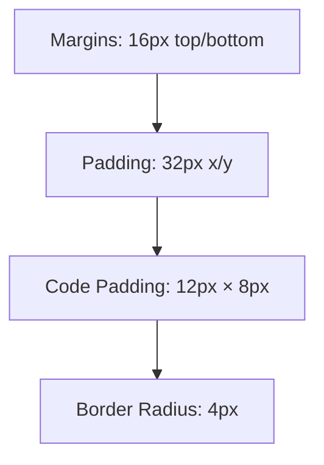

### Visual Spacing Guide

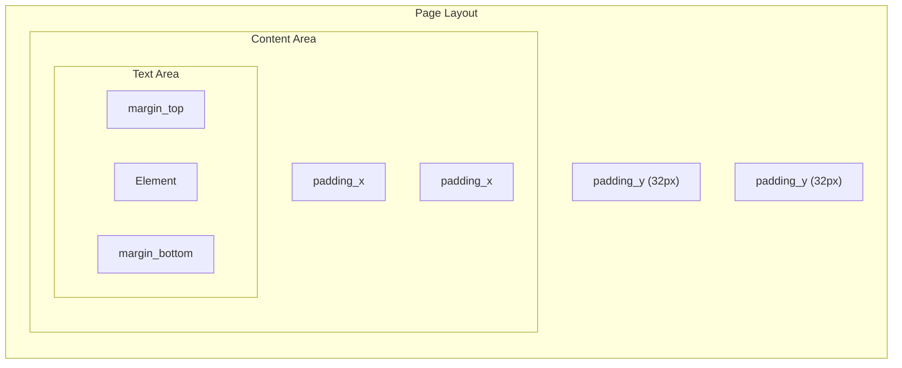

## Syntax Highlighting and Themes

Code block syntax highlighting automatically adapts to the theme's brightness:

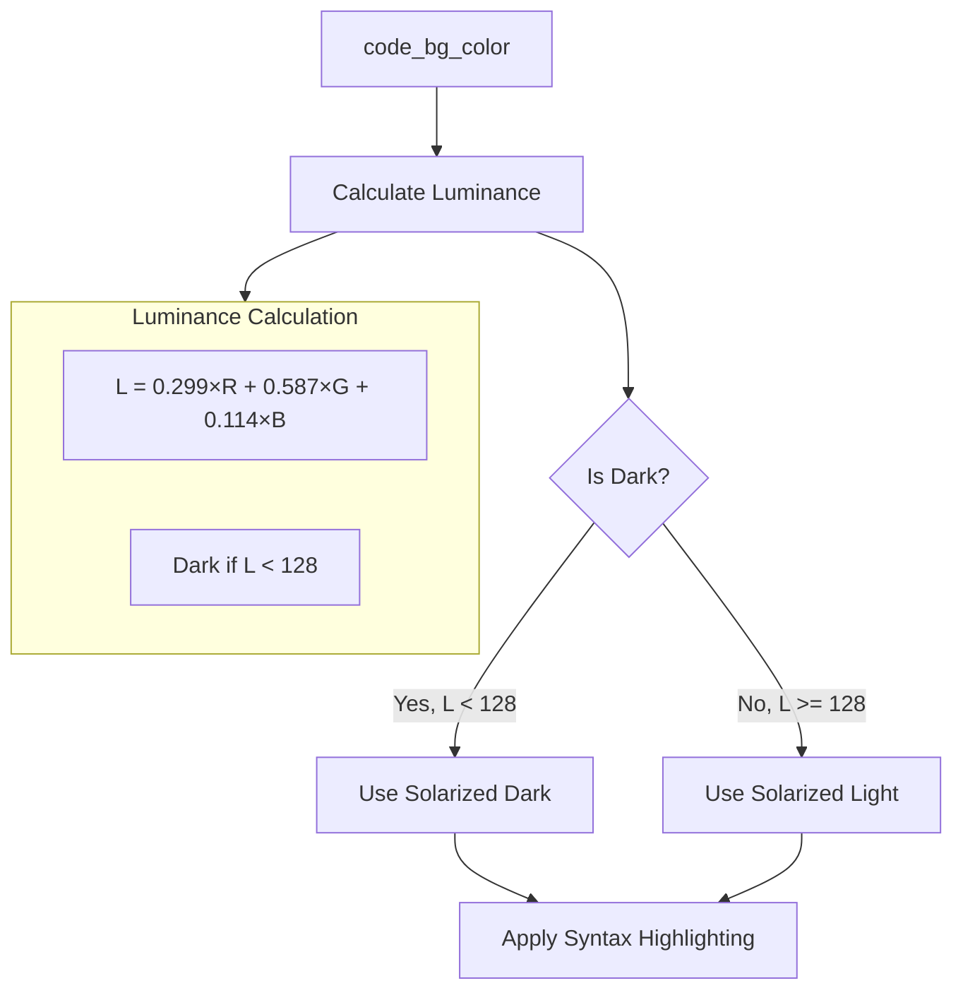

## Mermaid Diagram Styling

Mermaid diagram colors are derived from the theme:

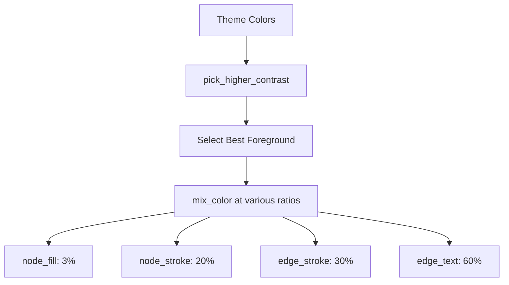

### Contrast Selection

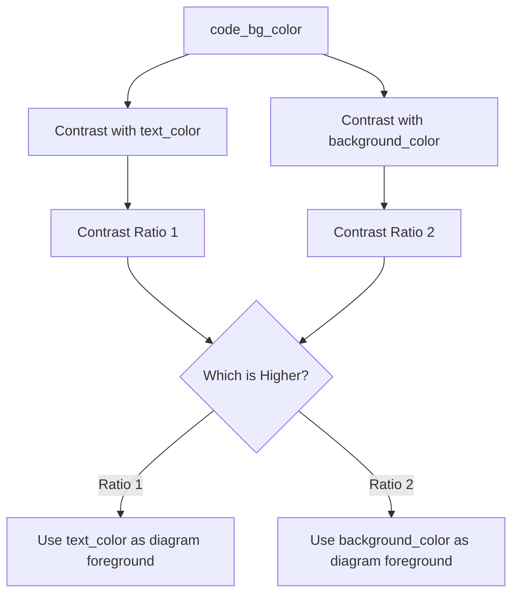

## Theme Inheritance and Defaults

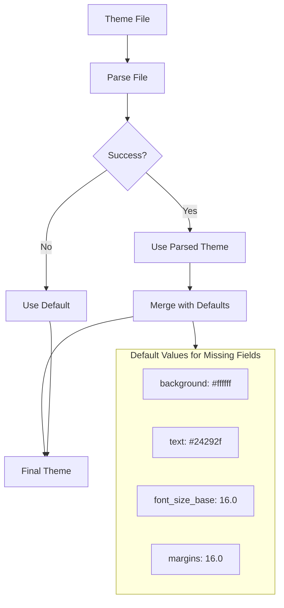

## Complete Theme Example

Here's a complete example showing how a theme affects the output:

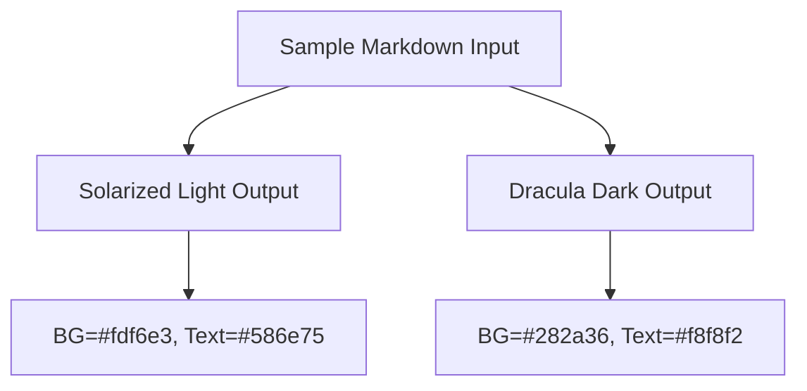

## Using Themes from the Command Line

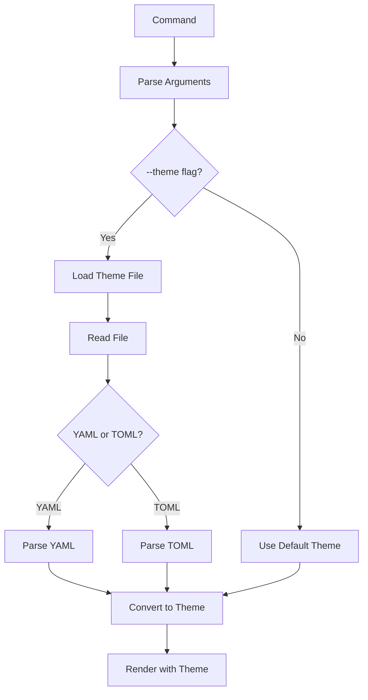

### Command Examples

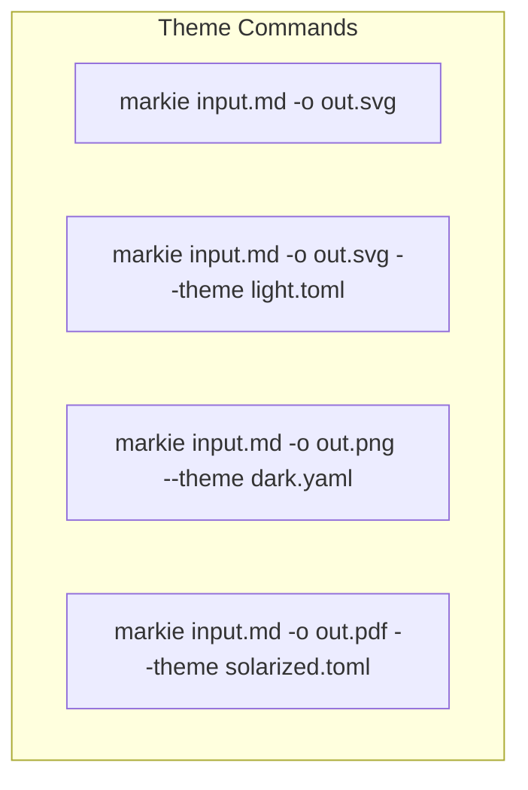

---

*Previous: [Mermaid Subsystem](03-mermaid-subsystem.md)*
*Next: [Output Formats](05-output-formats.md)*
