# Output Formats

> This document explains how Markie generates SVG, PNG, and PDF output files.

## Three Output Formats

Markie supports three output formats, each with its own use case:

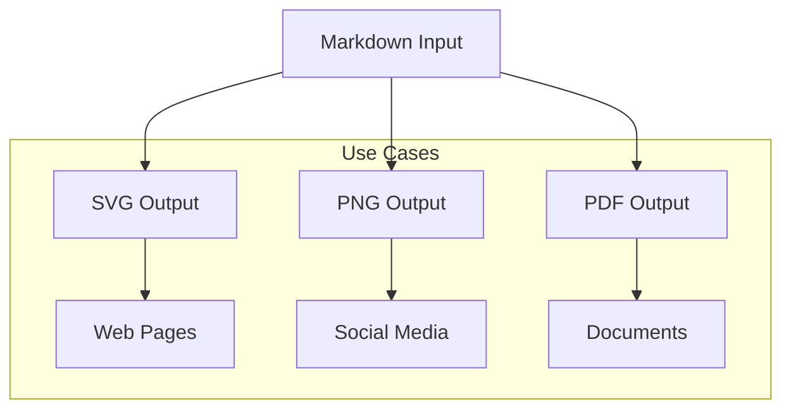
```mermaid
flowchart TB
    MD[Markdown Input] --> SVG[SVG Output]
    MD --> PNG[PNG Output]
    MD --> PDF[PDF Output]
    
    subgraph UseCases["Use Cases"]
        SVG --> WEB[Web Pages]
        PNG --> SOCIAL[Social Media]
        PDF --> PRINT[Documents]
    end
```

## Format Comparison

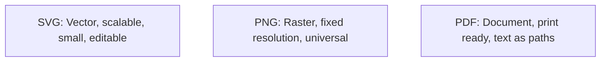
```mermaid
flowchart TB
    SVG["SVG: Vector, scalable, small, editable"]
    PNG["PNG: Raster, fixed resolution, universal"]
    PDF["PDF: Document, print ready, text as paths"]
```

## The Conversion Pipeline

All formats start as SVG, then are converted as needed:

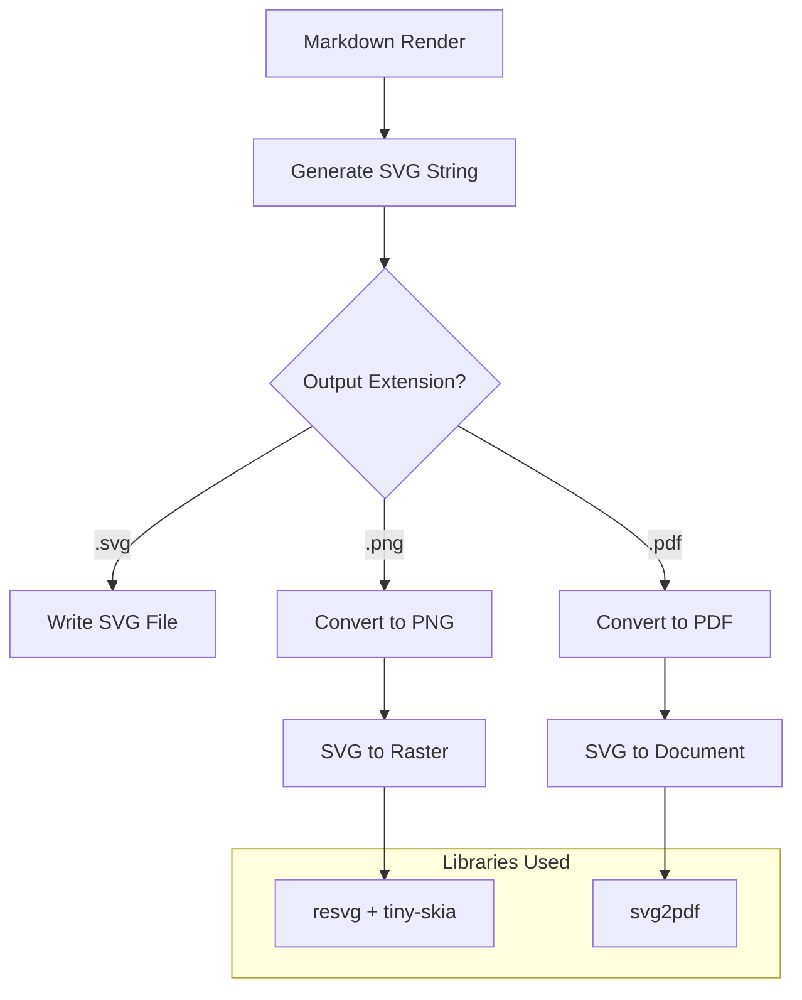
```mermaid
flowchart TB
    RENDER[Markdown Render] --> SVG_GEN[Generate SVG String]
    
    SVG_GEN --> EXT{Output Extension?}
    
    EXT -->|.svg| WRITE_SVG[Write SVG File]
    EXT -->|.png| CONVERT_PNG[Convert to PNG]
    EXT -->|.pdf| CONVERT_PDF[Convert to PDF]
    
    CONVERT_PNG --> SVG_TO_RASTER[SVG to Raster]
    CONVERT_PDF --> SVG_TO_DOC[SVG to Document]
    
    subgraph Libraries["Libraries Used"]
        RESVG["resvg + tiny-skia"]
        SVG2PDF["svg2pdf"]
    end
    
    SVG_TO_RASTER --> RESVG
    SVG_TO_DOC --> SVG2PDF
```

## SVG Output

SVG is the native format - all rendering produces SVG first:

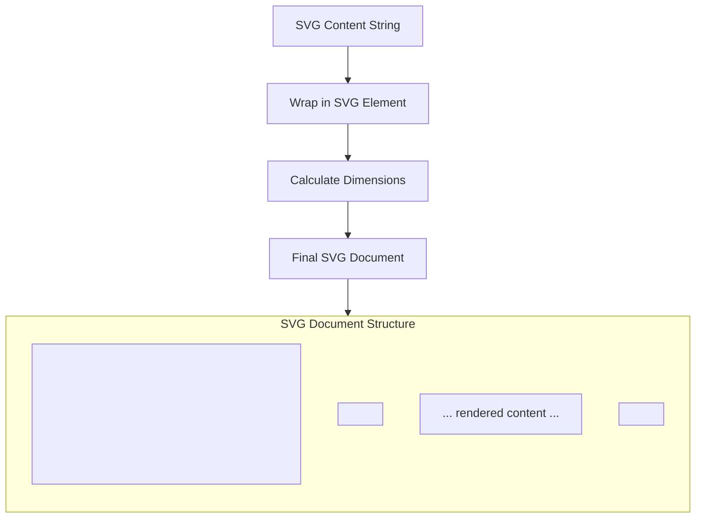
```mermaid
flowchart TB
    SVG_CONTENT[SVG Content String] --> WRAP[Wrap in SVG Element]
    WRAP --> CALC_DIMS[Calculate Dimensions]
    CALC_DIMS --> FINAL_SVG[Final SVG Document]
    
    subgraph SVGStructure["SVG Document Structure"]
        direction TB
        OPEN["<svg viewBox='0 0 width height'>"]
        BG["<rect fill='bg_color' .../>"]
        CONTENT["... rendered content ..."]
        CLOSE["</svg>"]
    end
    
    FINAL_SVG --> SVGStructure
```

### SVG Document Anatomy

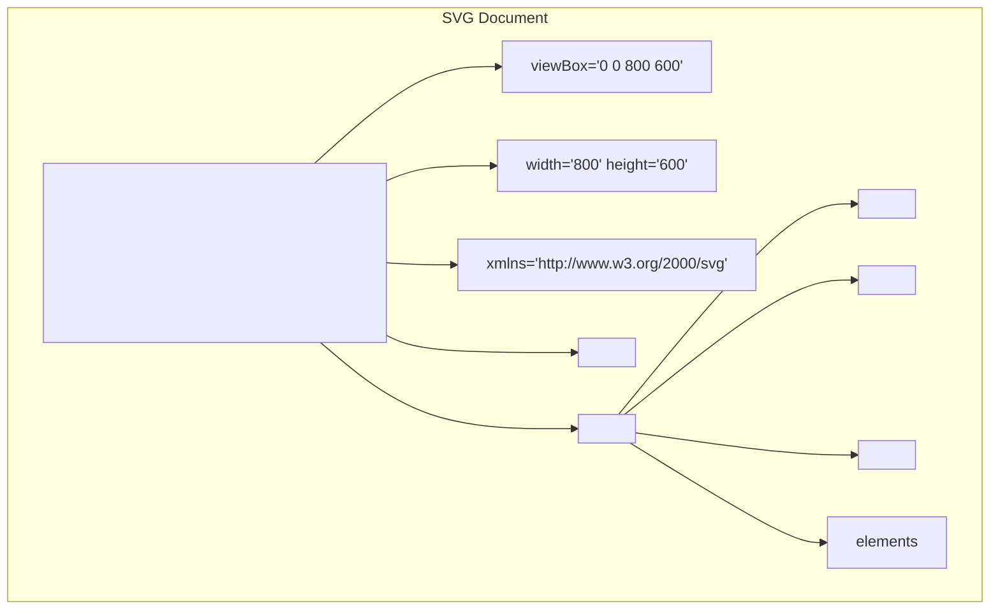
```mermaid
flowchart TB
    subgraph SVGDoc["SVG Document"]
        ROOT["<svg> root element"]
        ROOT --> ATTRS["viewBox='0 0 800 600'"]
        ROOT --> ATTRS2["width='800' height='600'"]
        ROOT --> ATTRS3["xmlns='http://www.w3.org/2000/svg'"]
        
        ROOT --> BACKGROUND["<rect> background"]
        ROOT --> GROUPS["<g> content groups"]
        
        GROUPS --> TEXT_E["<text> elements"]
        GROUPS --> RECT_E["<rect> shapes"]
        GROUPS --> PATH_E["<path> elements"]
        GROUPS --> IMAGE_E["<image> elements"]
    end
```

### SVG Advantages

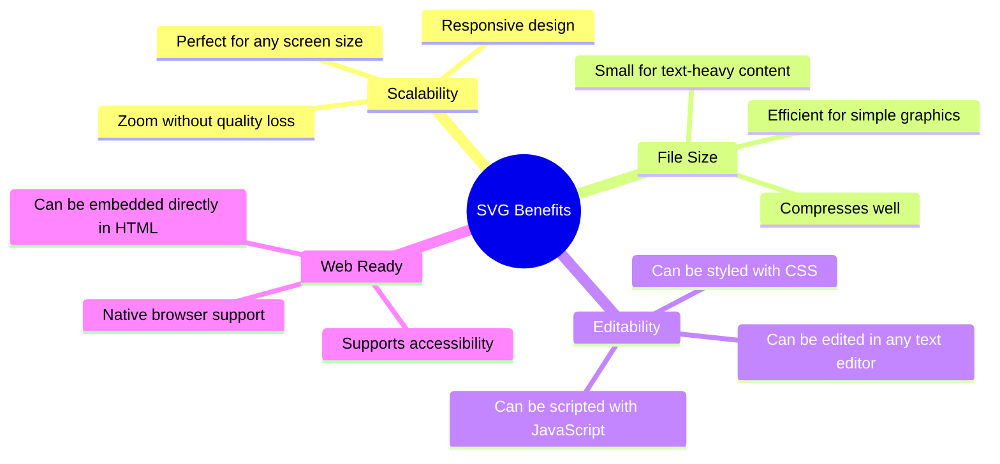
```mermaid
mindmap
  root((SVG Benefits))
    Scalability
      Zoom without quality loss
      Perfect for any screen size
      Responsive design
    File Size
      Small for text-heavy content
      Compresses well
      Efficient for simple graphics
    Editability
      Can be edited in any text editor
      Can be styled with CSS
      Can be scripted with JavaScript
    Web Ready
      Native browser support
      Can be embedded directly in HTML
      Supports accessibility
```

## PNG Output

PNG is a raster (pixel-based) format, converted from SVG:

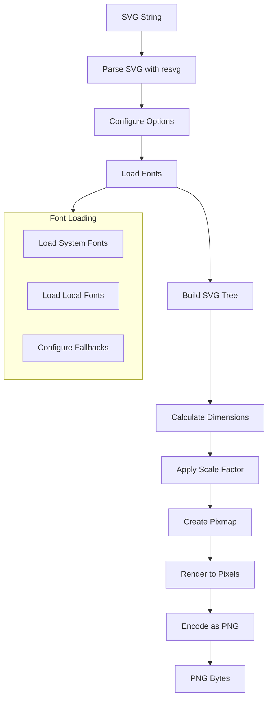
```mermaid
flowchart TB
    SVG_STRING[SVG String] --> PARSE[Parse SVG with resvg]
    PARSE --> OPTS[Configure Options]
    OPTS --> FONTS[Load Fonts]
    FONTS --> TREE[Build SVG Tree]
    TREE --> DIMS[Calculate Dimensions]
    DIMS --> SCALE[Apply Scale Factor]
    SCALE --> PIXMAP[Create Pixmap]
    PIXMAP --> RENDER[Render to Pixels]
    RENDER --> ENCODE[Encode as PNG]
    ENCODE --> BYTES[PNG Bytes]
    
    subgraph FontLoading["Font Loading"]
        SYSTEM[Load System Fonts]
        LOCAL[Load Local Fonts]
        FALLBACK[Configure Fallbacks]
    end
    
    FONTS --> FontLoading
```

### PNG Scale Factor

The `--png-scale` option controls output resolution:

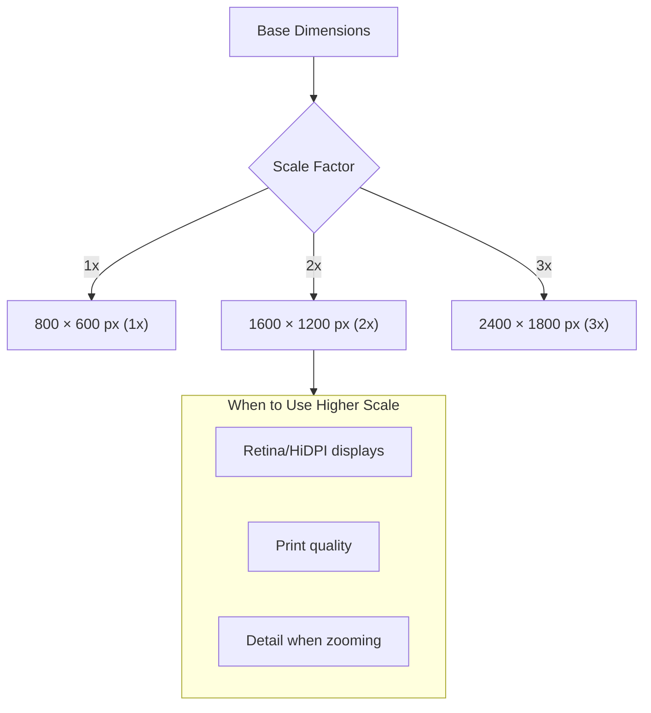
```mermaid
flowchart TB
    BASE["Base Dimensions"] --> SCALE{Scale Factor}
    
    SCALE -->|1x| S1["800 × 600 px (1x)"]
    SCALE -->|2x| S2["1600 × 1200 px (2x)"]
    SCALE -->|3x| S3["2400 × 1800 px (3x)"]
    
    subgraph UseCase["When to Use Higher Scale"]
        RETINA[Retina/HiDPI displays]
        PRINT[Print quality]
        ZOOM[Detail when zooming]
    end
    
    S2 --> UseCase
```

### PNG Conversion Process

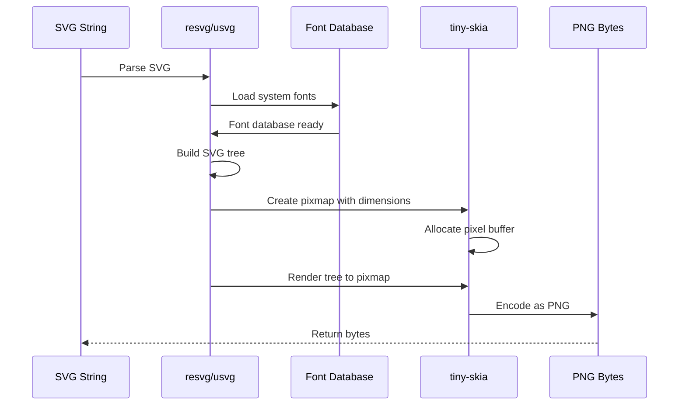
```mermaid
sequenceDiagram
    participant SVG as SVG String
    participant Resvg as resvg/usvg
    participant FontDB as Font Database
    participant Skia as tiny-skia
    participant PNG as PNG Bytes
    
    SVG->>Resvg: Parse SVG
    Resvg->>FontDB: Load system fonts
    FontDB->>Resvg: Font database ready
    Resvg->>Resvg: Build SVG tree
    Resvg->>Skia: Create pixmap with dimensions
    Skia->>Skia: Allocate pixel buffer
    Resvg->>Skia: Render tree to pixmap
    Skia->>PNG: Encode as PNG
    PNG-->>SVG: Return bytes
```

### Font Fallback Configuration

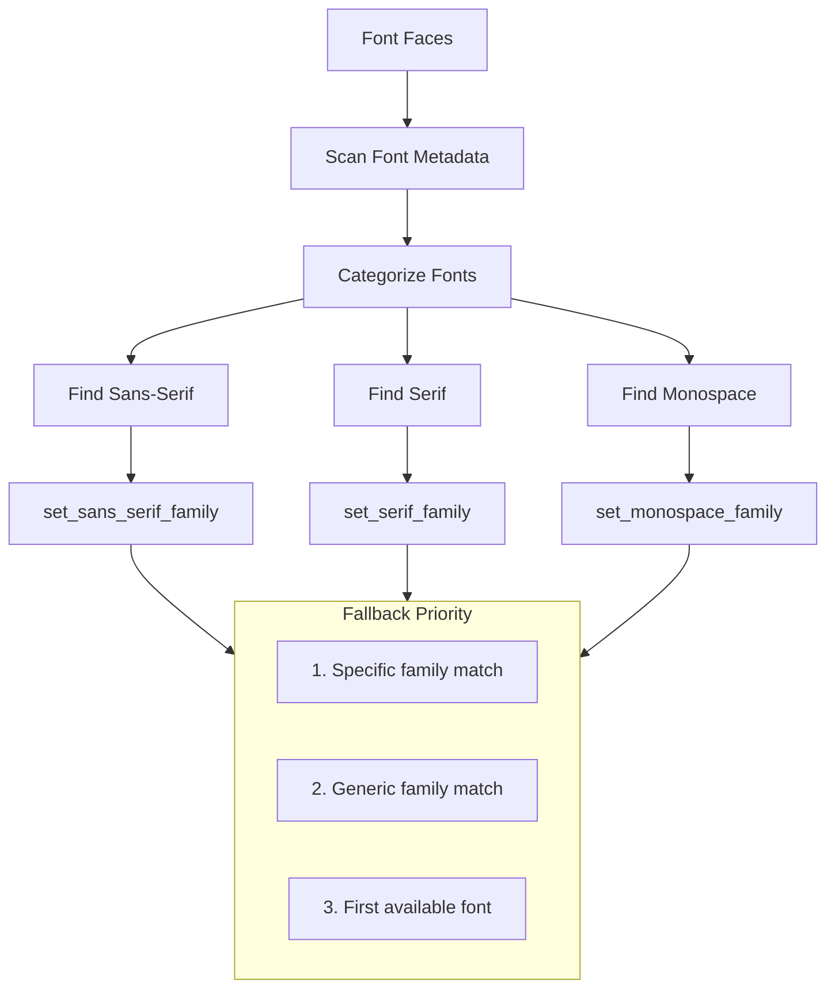
```mermaid
flowchart TB
    FACES[Font Faces] --> SCAN[Scan Font Metadata]
    SCAN --> CATEGORIZE[Categorize Fonts]
    
    CATEGORIZE --> SANS[Find Sans-Serif]
    CATEGORIZE --> SERIF[Find Serif]
    CATEGORIZE --> MONO[Find Monospace]
    
    SANS --> SET_SANS[set_sans_serif_family]
    SERIF --> SET_SERIF[set_serif_family]
    MONO --> SET_MONO[set_monospace_family]
    
    subgraph Priority["Fallback Priority"]
        P1["1. Specific family match"]
        P2["2. Generic family match"]
        P3["3. First available font"]
    end
    
    SET_SANS --> Priority
    SET_SERIF --> Priority
    SET_MONO --> Priority
```

## PDF Output

PDF is a document format, converted from SVG:

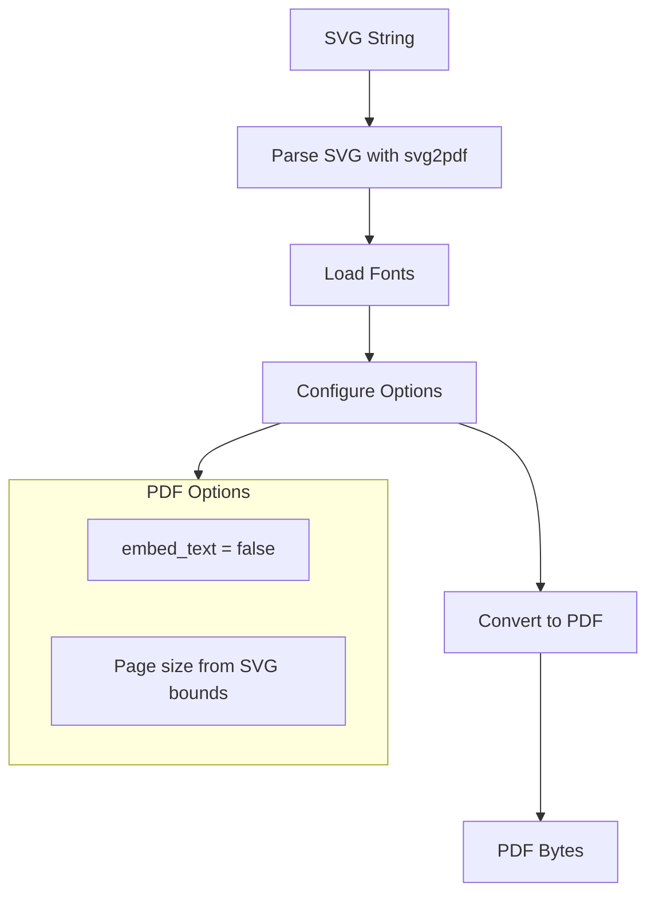
```mermaid
flowchart TB
    SVG_STRING[SVG String] --> PARSE_PDF[Parse SVG with svg2pdf]
    PARSE_PDF --> FONTDB_PDF[Load Fonts]
    FONTDB_PDF --> OPTS_PDF[Configure Options]
    OPTS_PDF --> CONVERT_PDF[Convert to PDF]
    CONVERT_PDF --> PDF_BYTES[PDF Bytes]
    
    subgraph PDFOptions["PDF Options"]
        EMBED_TEXT["embed_text = false"]
        PAGE["Page size from SVG bounds"]
    end
    
    OPTS_PDF --> PDFOptions
```

### Why Text as Paths?

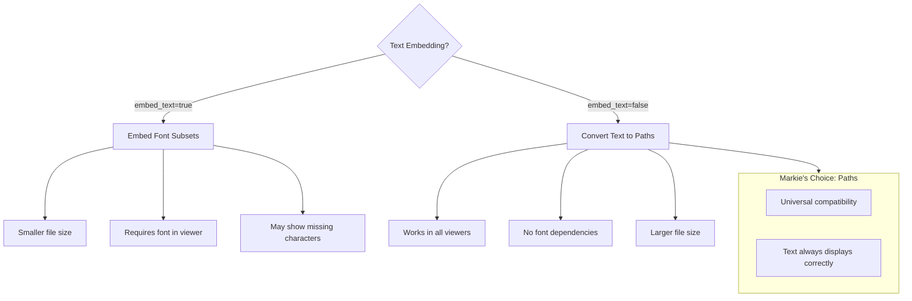
```mermaid
flowchart TB
    CHOICE{Text Embedding?}
    
    CHOICE -->|embed_text=true| EMBED[Embed Font Subsets]
    CHOICE -->|embed_text=false| PATHS[Convert Text to Paths]
    
    EMBED --> PRO_E[Smaller file size]
    EMBED --> CON_E[Requires font in viewer]
    EMBED --> CON_E2[May show missing characters]
    
    PATHS --> PRO_P[Works in all viewers]
    PATHS --> PRO_P2[No font dependencies]
    PATHS --> CON_P[Larger file size]
    
    subgraph Decision["Markie's Choice: Paths"]
        REASON["Universal compatibility"]
        BENEFIT["Text always displays correctly"]
    end
    
    PATHS --> Decision
```

### PDF Conversion Flow

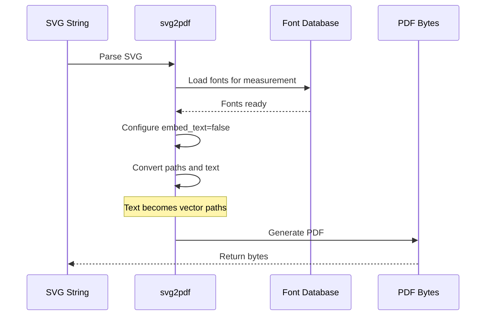
```mermaid
sequenceDiagram
    participant SVG as SVG String
    participant S2P as svg2pdf
    participant FontDB as Font Database
    participant PDF as PDF Bytes
    
    SVG->>S2P: Parse SVG
    S2P->>FontDB: Load fonts for measurement
    FontDB-->>S2P: Fonts ready
    S2P->>S2P: Configure embed_text=false
    S2P->>S2P: Convert paths and text
    Note over S2P: Text becomes vector paths
    S2P->>PDF: Generate PDF
    PDF-->>SVG: Return bytes
```

## Output Determination

The output format is determined by the file extension:

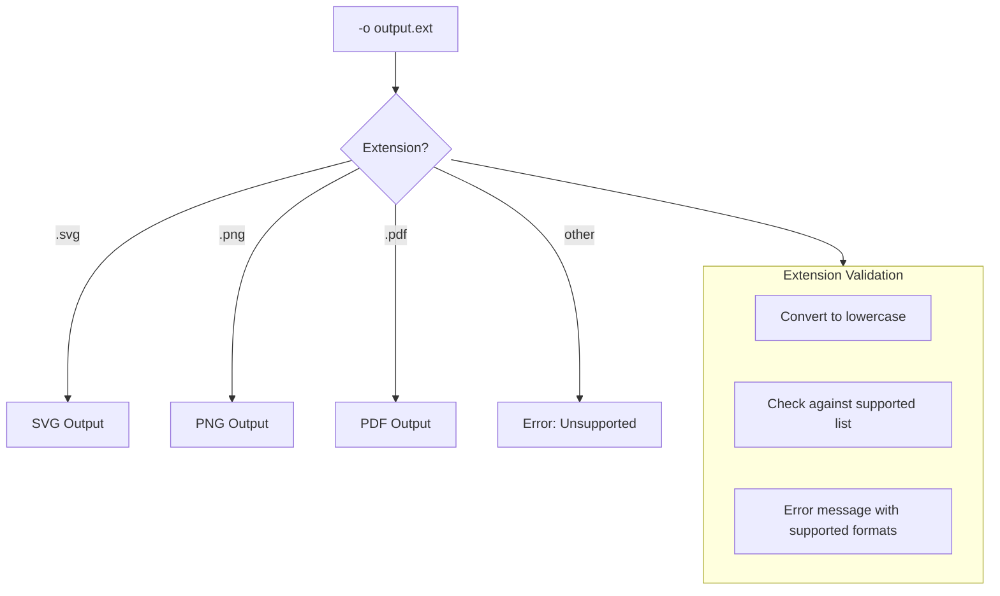
```mermaid
flowchart TB
    OUTPUT["-o output.ext"] --> EXT{Extension?}
    
    EXT -->|.svg| SVG_OUT[SVG Output]
    EXT -->|.png| PNG_OUT[PNG Output]
    EXT -->|.pdf| PDF_OUT[PDF Output]
    EXT -->|other| ERROR[Error: Unsupported]
    
    subgraph Validation["Extension Validation"]
        LOWER["Convert to lowercase"]
        CHECK["Check against supported list"]
        MSG["Error message with supported formats"]
    end
    
    EXT --> Validation
```

## Size Calculation

Each format calculates output dimensions:

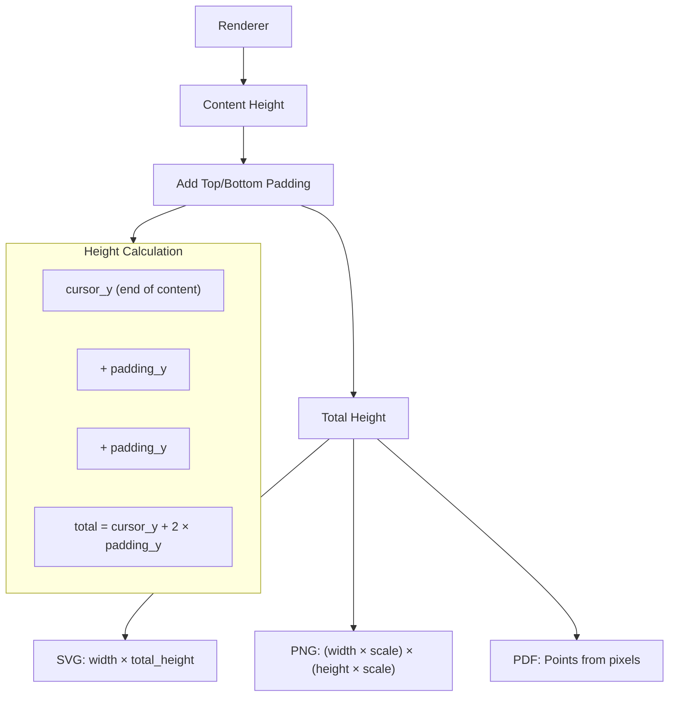
```mermaid
flowchart TB
    RENDER[Renderer] --> CONTENT_HEIGHT[Content Height]
    CONTENT_HEIGHT --> ADD_PADDING[Add Top/Bottom Padding]
    ADD_PADDING --> TOTAL_HEIGHT[Total Height]
    
    TOTAL_HEIGHT --> SVG_DIMS["SVG: width × total_height"]
    TOTAL_HEIGHT --> PNG_DIMS["PNG: (width × scale) × (height × scale)"]
    TOTAL_HEIGHT --> PDF_DIMS["PDF: Points from pixels"]
    
    subgraph Calculation["Height Calculation"]
        CURSOR["cursor_y (end of content)"]
        PAD_TOP["+ padding_y"]
        PAD_BOTTOM["+ padding_y"]
        FORMULA["total = cursor_y + 2 × padding_y"]
    end
    
    ADD_PADDING --> Calculation
```

## Command Line Usage

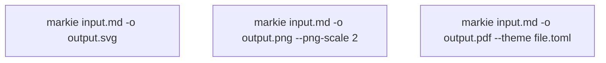
```mermaid
flowchart TB
    SVG_CMD["markie input.md -o output.svg"]
    PNG_CMD["markie input.md -o output.png --png-scale 2"]
    PDF_CMD["markie input.md -o output.pdf --theme file.toml"]
```

## Performance Considerations

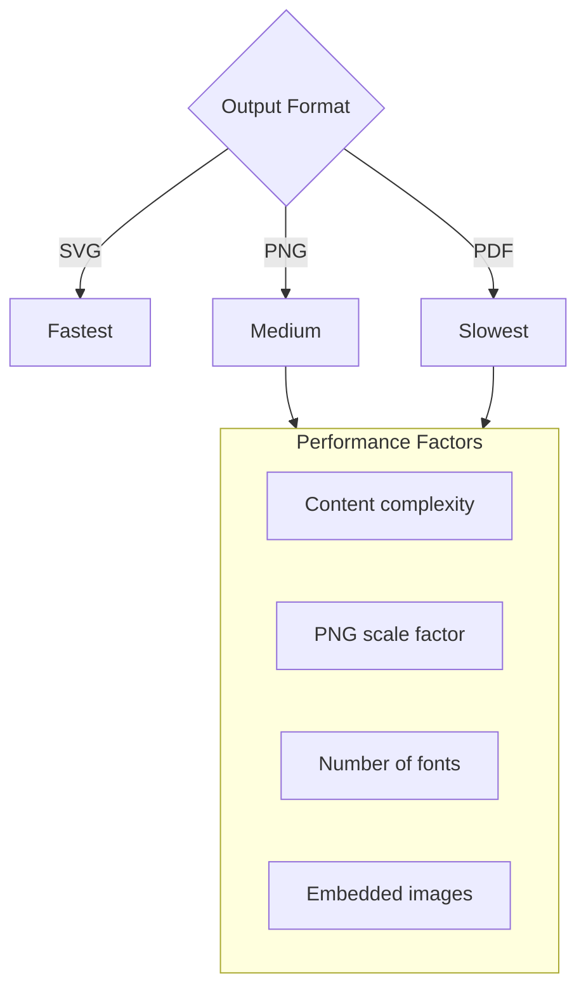
```mermaid
flowchart TB
    FORMAT{Output Format}
    
    FORMAT -->|SVG| FAST[Fastest]
    FORMAT -->|PNG| MEDIUM[Medium]
    FORMAT -->|PDF| SLOWER[Slowest]
    
    subgraph Factors["Performance Factors"]
        CONTENT_SIZE[Content complexity]
        SCALE_FACTOR[PNG scale factor]
        FONT_COUNT[Number of fonts]
        IMAGE_COUNT[Embedded images]
    end
    
    MEDIUM --> Factors
    SLOWER --> Factors
```

## File Size Comparison

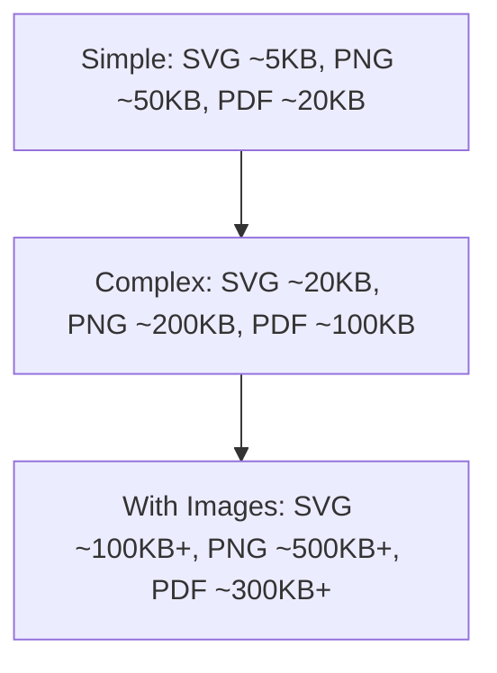
```mermaid
flowchart TB
    SIMPLE["Simple: SVG ~5KB, PNG ~50KB, PDF ~20KB"]
    COMPLEX["Complex: SVG ~20KB, PNG ~200KB, PDF ~100KB"]
    IMAGES["With Images: SVG ~100KB+, PNG ~500KB+, PDF ~300KB+"]
    SIMPLE --> COMPLEX --> IMAGES
```

## Quality vs Size Trade-offs

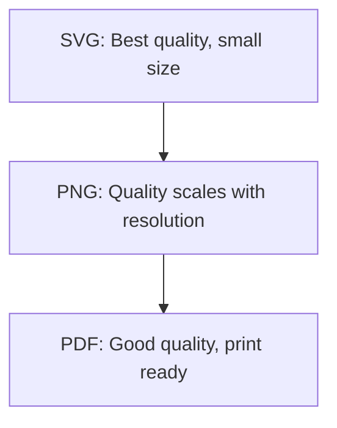
```mermaid
flowchart TB
    SVG_TRADE["SVG: Best quality, small size"]
    PNG_TRADE["PNG: Quality scales with resolution"]
    PDF_TRADE["PDF: Good quality, print ready"]
    SVG_TRADE --> PNG_TRADE --> PDF_TRADE
```

## Error Handling

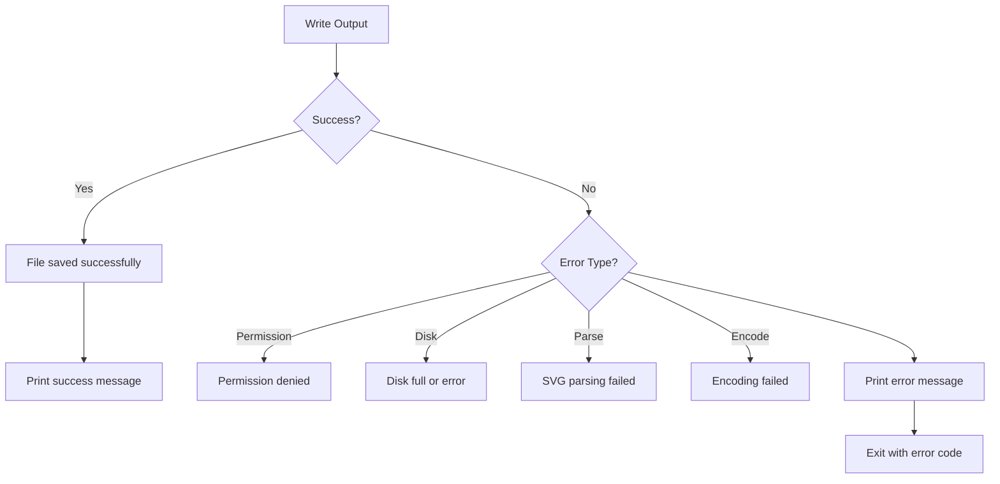
```mermaid
flowchart TB
    WRITE[Write Output] --> RESULT{Success?}
    
    RESULT -->|Yes| SUCCESS["File saved successfully"]
    RESULT -->|No| ERROR{Error Type?}
    
    ERROR -->|Permission| PERM["Permission denied"]
    ERROR -->|Disk| DISK["Disk full or error"]
    ERROR -->|Parse| PARSE_ERR["SVG parsing failed"]
    ERROR -->|Encode| ENCODE_ERR["Encoding failed"]
    
    SUCCESS --> PRINT["Print success message"]
    ERROR --> PRINT_ERR["Print error message"]
    PRINT_ERR --> EXIT["Exit with error code"]
```

---

*Previous: [Theme System](04-theme-system.md)*
*Next: [Math Rendering](06-math-rendering.md)*
