# Math Rendering

> This document explains how Markie renders LaTeX mathematical expressions.

## Overview

Markie converts LaTeX math expressions into SVG graphics. This allows you to include mathematical formulas in your Markdown documents.

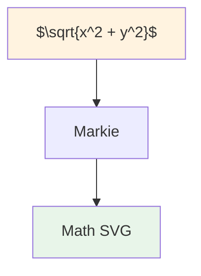
```mermaid
flowchart TB
    LATEX["$\sqrt{x^2 + y^2}$"] --> MARKIE[Markie]
    MARKIE --> SVG[Math SVG]
    
    style LATEX fill:#fff3e0
    style SVG fill:#e8f5e9
```

## Supported Syntax

Markie supports both inline and display math:

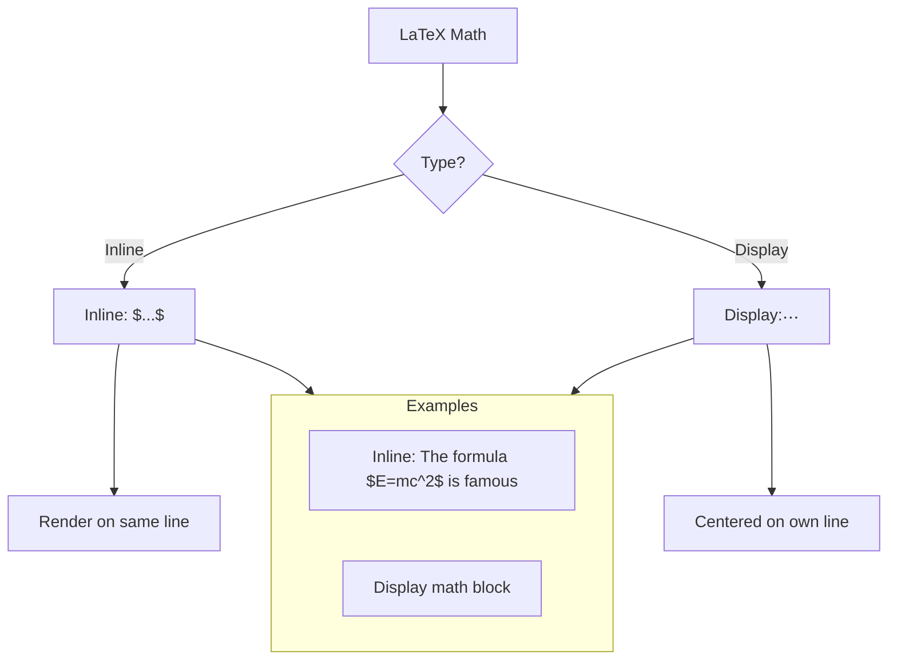
```mermaid
flowchart TB
    MATH[LaTeX Math] --> TYPE{Type?}
    
    TYPE -->|Inline| INLINE["Inline: $...$"]
    TYPE -->|Display| DISPLAY["Display: $$...$$"]
    
    INLINE --> SAME_LINE[Render on same line]
    DISPLAY --> CENTERED[Centered on own line]
    
    subgraph Examples["Examples"]
        I_EX["Inline: The formula $E=mc^2$ is famous"]
        D_EX["Display math block"]
    end
    
    INLINE --> Examples
    DISPLAY --> Examples
```

## The Math Rendering Pipeline

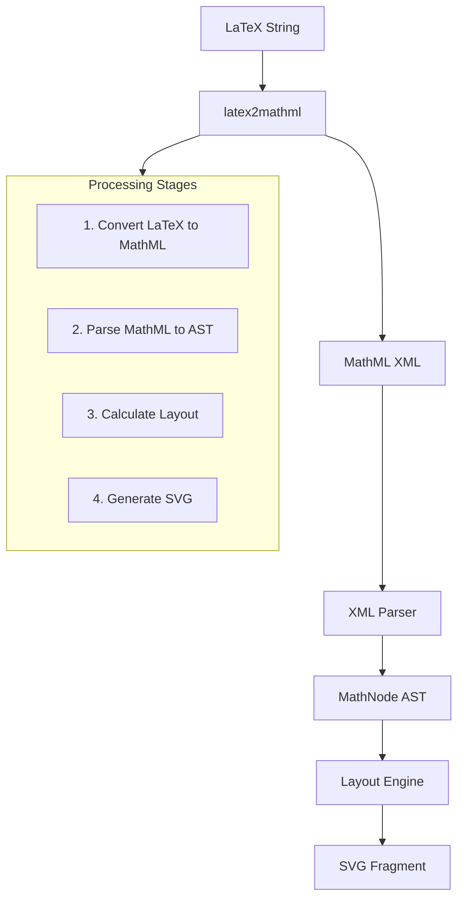
```mermaid
flowchart TB
    LATEX[LaTeX String] --> L2M[latex2mathml]
    L2M --> MATHML[MathML XML]
    MATHML --> PARSE[XML Parser]
    PARSE --> AST[MathNode AST]
    AST --> LAYOUT[Layout Engine]
    LAYOUT --> SVG[SVG Fragment]
    
    subgraph Stages["Processing Stages"]
        S1["1. Convert LaTeX to MathML"]
        S2["2. Parse MathML to AST"]
        S3["3. Calculate Layout"]
        S4["4. Generate SVG"]
    end
    
    L2M --> Stages
```

## Stage 1: LaTeX to MathML

The first stage converts LaTeX to MathML using the `latex2mathml` library:

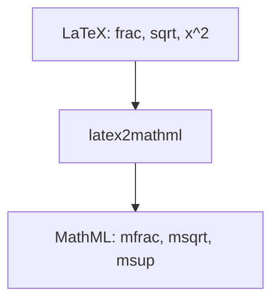
```mermaid
flowchart TB
    L1["LaTeX: frac, sqrt, x^2"] --> CONVERT[latex2mathml]
    CONVERT --> M1["MathML: mfrac, msqrt, msup"]
```

### Supported LaTeX Commands

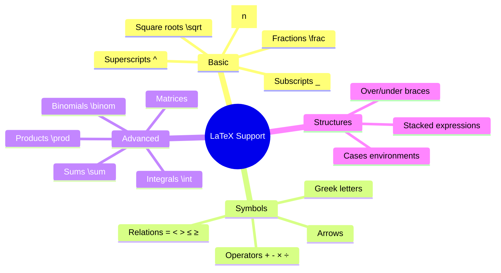
```mermaid
mindmap
  root((LaTeX Support))
    Basic
      Fractions \frac
      Square roots \sqrt
      nth roots \sqrt[n]
      Superscripts ^
      Subscripts _
    Symbols
      Greek letters
      Operators + - × ÷
      Relations = < > ≤ ≥
      Arrows
    Advanced
      Matrices
      Binomials \binom
      Sums \sum
      Products \prod
      Integrals \int
    Structures
      Over/under braces
      Stacked expressions
      Cases environments
```

## Stage 2: MathML Parsing

The MathML is parsed into an Abstract Syntax Tree (AST):

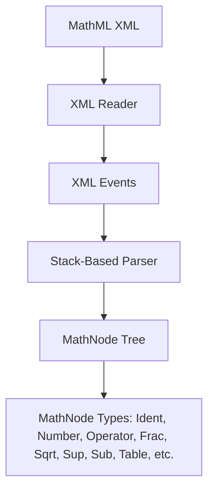
```mermaid
flowchart TB
    MATHML[MathML XML] --> READER[XML Reader]
    READER --> EVENTS[XML Events]
    EVENTS --> STACK[Stack-Based Parser]
    STACK --> AST[MathNode Tree]
    
    AST --> TYPES["MathNode Types: Ident, Number, Operator, Frac, Sqrt, Sup, Sub, Table, etc."]
```

### AST Node Types

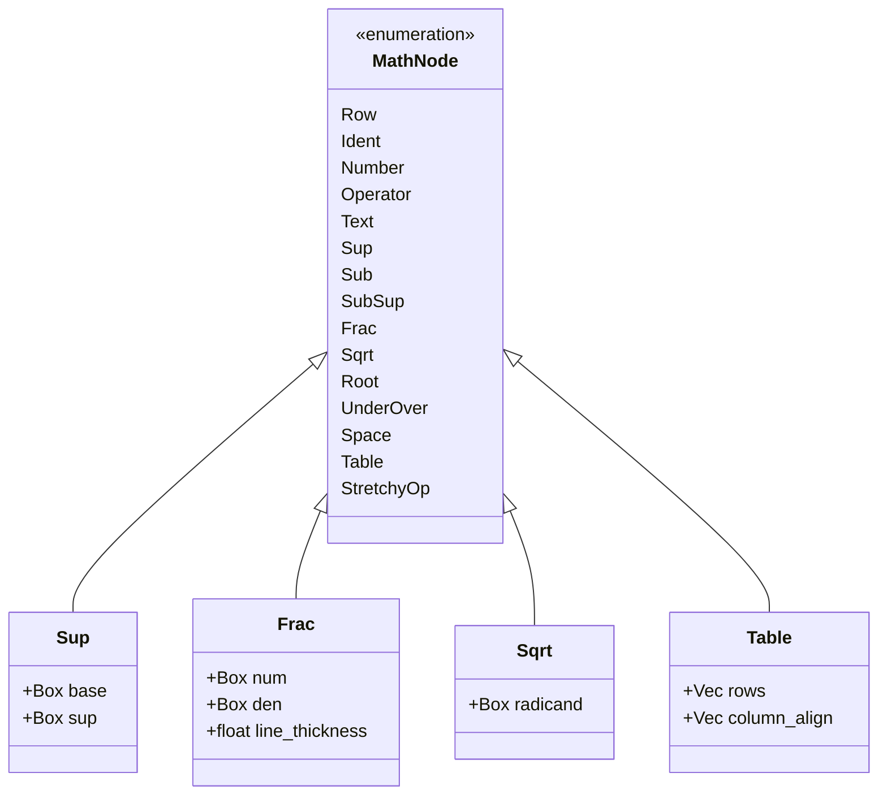
```mermaid
classDiagram
    class MathNode {
        <<enumeration>>
        Row
        Ident
        Number
        Operator
        Text
        Sup
        Sub
        SubSup
        Frac
        Sqrt
        Root
        UnderOver
        Space
        Table
        StretchyOp
    }
    
    class Sup {
        +Box base
        +Box sup
    }
    
    class Frac {
        +Box num
        +Box den
        +float line_thickness
    }
    
    class Sqrt {
        +Box radicand
    }
    
    class Table {
        +Vec rows
        +Vec column_align
    }
    
    MathNode <|-- Sup
    MathNode <|-- Frac
    MathNode <|-- Sqrt
    MathNode <|-- Table
```

## Stage 3: Layout Calculation

The layout engine calculates positions and sizes for each node:

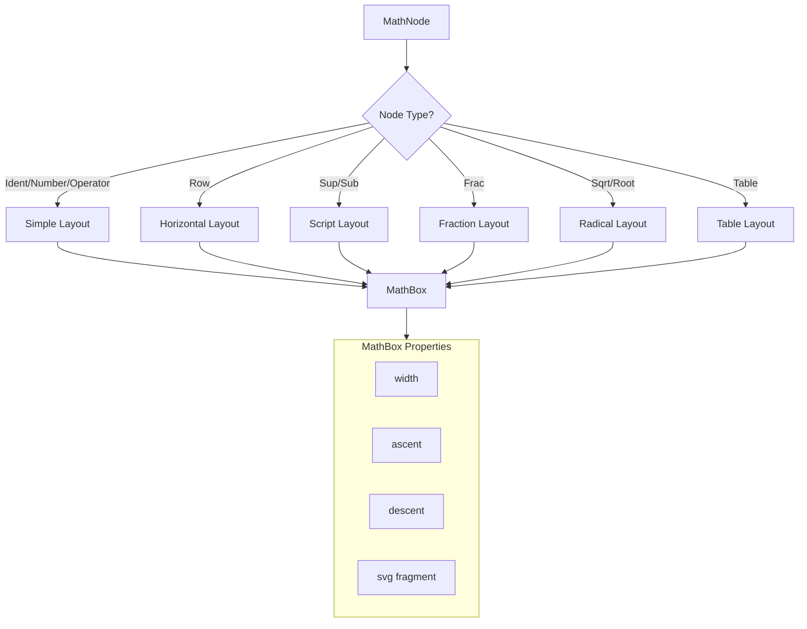
```mermaid
flowchart TB
    NODE[MathNode] --> TYPE{Node Type?}
    
    TYPE -->|Ident/Number/Operator| SIMPLE[Simple Layout]
    TYPE -->|Row| HORIZONTAL[Horizontal Layout]
    TYPE -->|Sup/Sub| SCRIPT[Script Layout]
    TYPE -->|Frac| FRACTION[Fraction Layout]
    TYPE -->|Sqrt/Root| RADICAL[Radical Layout]
    TYPE -->|Table| MATRIX[Table Layout]
    
    SIMPLE --> MATHBOX[MathBox]
    HORIZONTAL --> MATHBOX
    SCRIPT --> MATHBOX
    FRACTION --> MATHBOX
    RADICAL --> MATHBOX
    MATRIX --> MATHBOX
    
    subgraph MathBoxProps["MathBox Properties"]
        WIDTH[width]
        ASCENT[ascent]
        DESCENT[descent]
        SVG[svg fragment]
    end
    
    MATHBOX --> MathBoxProps
```

### Layout Dimensions

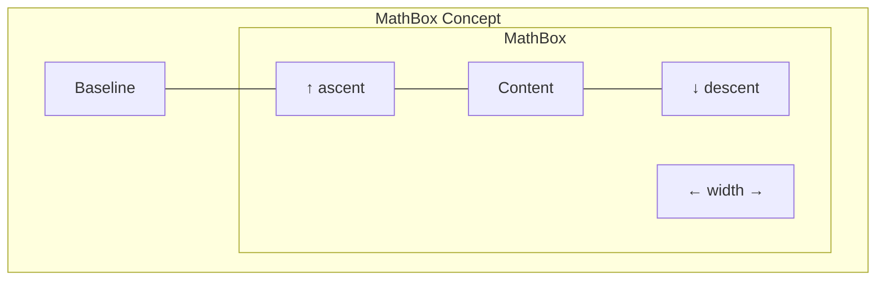
```mermaid
flowchart TB
    subgraph MathBoxDiagram["MathBox Concept"]
        BASELINE[Baseline]
        
        subgraph Box["MathBox"]
            ASCENT_AREA["↑ ascent"]
            CONTENT["Content"]
            DESCENT_AREA["↓ descent"]
            WIDTH_EXTENT["← width →"]
        end
        
        BASELINE --- ASCENT_AREA
        ASCENT_AREA --- CONTENT
        CONTENT --- DESCENT_AREA
    end
```

### Fraction Layout

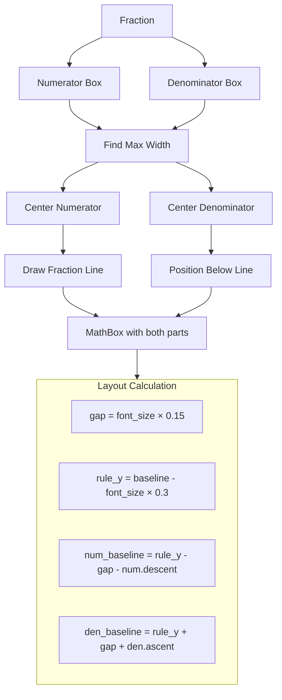
```mermaid
flowchart TB
    FRAC[Fraction] --> NUM[Numerator Box]
    FRAC --> DEN[Denominator Box]
    
    NUM --> MAX_WIDTH[Find Max Width]
    DEN --> MAX_WIDTH
    
    MAX_WIDTH --> CENTER_NUM[Center Numerator]
    MAX_WIDTH --> CENTER_DEN[Center Denominator]
    
    CENTER_NUM --> DRAW_LINE[Draw Fraction Line]
    CENTER_DEN --> POSITION_BELOW[Position Below Line]
    
    DRAW_LINE --> FINAL[MathBox with both parts]
    POSITION_BELOW --> FINAL
    
    subgraph FractionLayout["Layout Calculation"]
        GAP["gap = font_size × 0.15"]
        RULE_Y["rule_y = baseline - font_size × 0.3"]
        NUM_Y["num_baseline = rule_y - gap - num.descent"]
        DEN_Y["den_baseline = rule_y + gap + den.ascent"]
    end
    
    FINAL --> FractionLayout
```

### Superscript/Subscript Layout

```mermaid
flowchart TB
    SCRIPT["x² Layout"] --> BASE[Base: "x"]
    SCRIPT --> SUPER[Superscript: "2"]
    
    BASE --> BASE_POS[Position at baseline]
    SUPER --> SCALE[Scale to 70% size]
    SCALE --> OFFSET_Y[Offset above baseline]
    
    OFFSET_Y --> PLACE[Place after base]
    
    subgraph Calculations["Position Calculations"]
        SUP_SIZE["sup_size = font_size × 0.7"]
        SUP_Y["sup_y = baseline - base.ascent × 0.55"]
        SUP_X["sup_x = base.x + base.width"]
    end
    
    PLACE --> Calculations
```

### Matrix/Table Layout

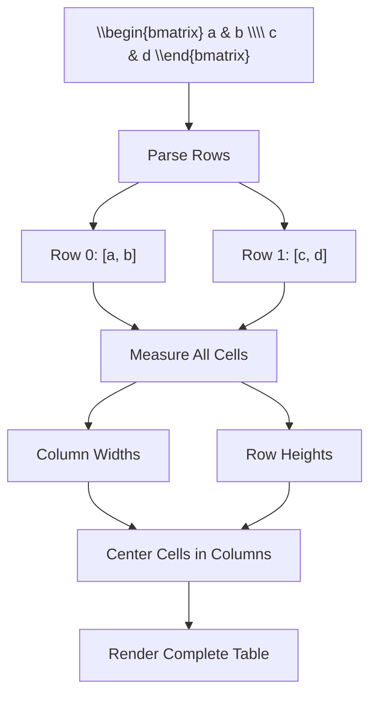
```mermaid
flowchart TB
    TABLE["\\begin{bmatrix} a & b \\\\ c & d \\end{bmatrix}"]
    
    TABLE --> ROWS[Parse Rows]
    ROWS --> ROW1["Row 0: [a, b]"]
    ROWS --> ROW2["Row 1: [c, d]"]
    
    ROW1 --> MEASURE[Measure All Cells]
    ROW2 --> MEASURE
    
    MEASURE --> COL_WIDTHS["Column Widths"]
    MEASURE --> ROW_HEIGHTS["Row Heights"]
    
    COL_WIDTHS --> CENTER[Center Cells in Columns]
    ROW_HEIGHTS --> CENTER
    
    CENTER --> RENDER_TABLE[Render Complete Table]
```

## Stage 4: SVG Generation

The final stage generates SVG elements from the layout:

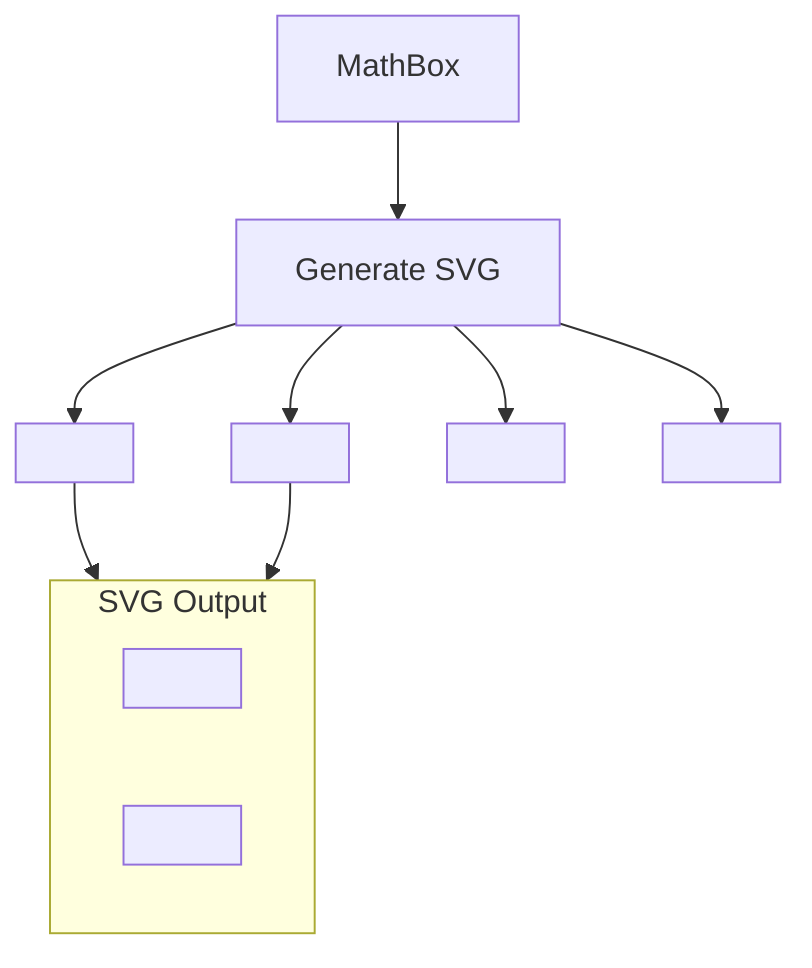
```mermaid
flowchart TB
    MATHBOX[MathBox] --> SVG_GEN[Generate SVG]
    
    SVG_GEN --> TEXT_E["<text> for Ident/Number/Operator"]
    SVG_GEN --> PATH_E["<path> for radicals"]
    SVG_GEN --> LINE_E["<line> for fraction bars"]
    SVG_GEN --> GROUP_E["<g> for composite elements"]
    
    subgraph SVGOutput["SVG Output"]
        TEXT_ELEM["<text x='...' y='...' font-family='serif' font-size='...' fill='...'>content</text>"]
        PATH_ELEM["<path d='M x1 y1 L x2 y2 ...' stroke='...' fill='none'/>"]
    end
    
    TEXT_E --> SVGOutput
    PATH_E --> SVGOutput
```

### Text Styling

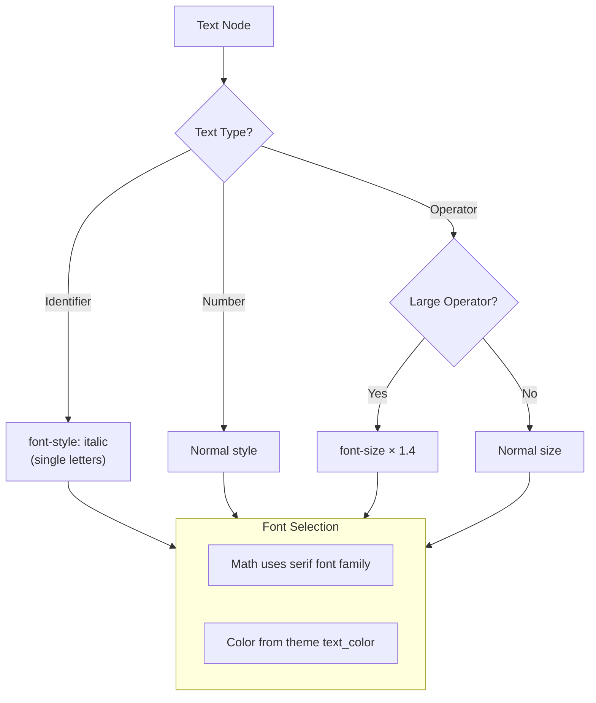
```mermaid
flowchart TB
    TEXT[Text Node] --> CHECK{Text Type?}
    
    CHECK -->|Identifier| ITALIC["font-style: italic<br/>(single letters)"]
    CHECK -->|Number| UPRIGHT["Normal style"]
    CHECK -->|Operator| LARGE{Large Operator?}
    
    LARGE -->|Yes| BIGGER["font-size × 1.4"]
    LARGE -->|No| NORMAL["Normal size"]
    
    subgraph FontSelection["Font Selection"]
        SERIF["Math uses serif font family"]
        COLOR["Color from theme text_color"]
    end
    
    ITALIC --> FontSelection
    UPRIGHT --> FontSelection
    BIGGER --> FontSelection
    NORMAL --> FontSelection
```

## Special Cases

### Large Operators

Large operators like sums and integrals are rendered bigger:

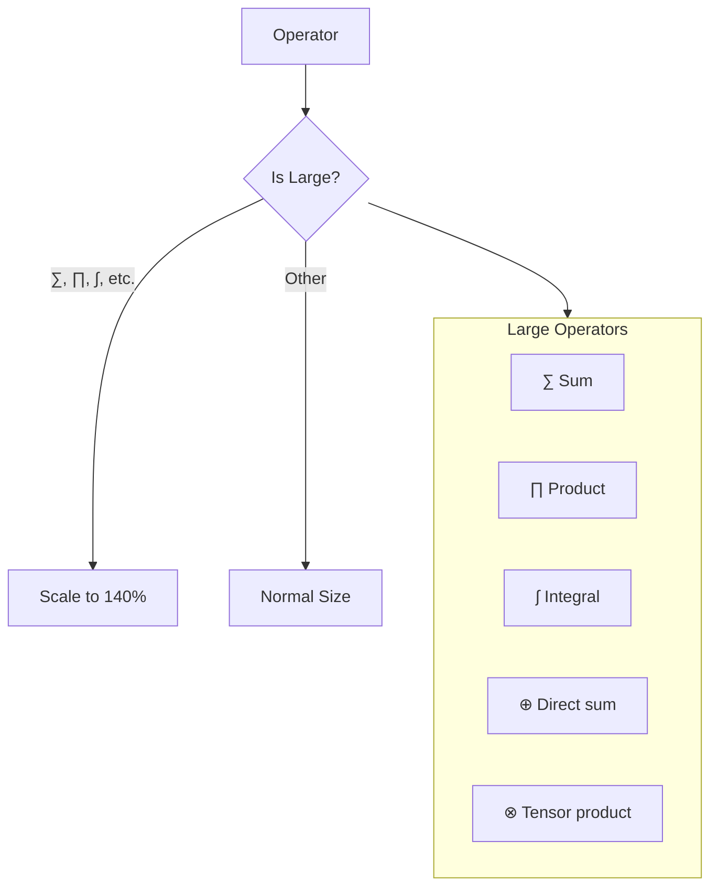
```mermaid
flowchart TB
    OP[Operator] --> CHECK{Is Large?}
    
    CHECK -->|"∑, ∏, ∫, etc."| SCALE[Scale to 140%]
    CHECK -->|Other| NORMAL_SIZE[Normal Size]
    
    subgraph LargeOps["Large Operators"]
        SUM["∑ Sum"]
        PROD["∏ Product"]
        INT["∫ Integral"]
        OPLUS["⊕ Direct sum"]
        OTIMES["⊗ Tensor product"]
    end
    
    CHECK --> LargeOps
```

### nth Roots

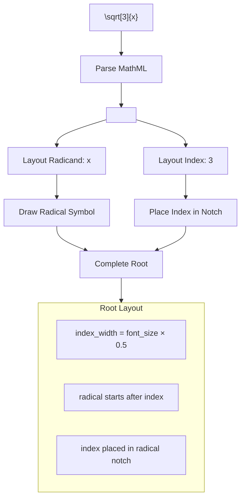
```mermaid
flowchart TB
    NROOT["\sqrt[3]{x}"] --> PARSE[Parse MathML]
    PARSE --> MROOT["<mroot> base, index </mroot>"]
    
    MROOT --> RADICAND[Layout Radicand: x]
    MROOT --> INDEX[Layout Index: 3]
    
    RADICAND --> RADICAL_PATH[Draw Radical Symbol]
    INDEX --> PLACE_INDEX[Place Index in Notch]
    RADICAL_PATH --> FINAL[Complete Root]
    PLACE_INDEX --> FINAL
    
    subgraph RootLayout["Root Layout"]
        INDEX_WIDTH["index_width = font_size × 0.5"]
        RADICAL_START["radical starts after index"]
        NOTCH["index placed in radical notch"]
    end
    
    FINAL --> RootLayout
```

### Binomials (Line-less Fractions)

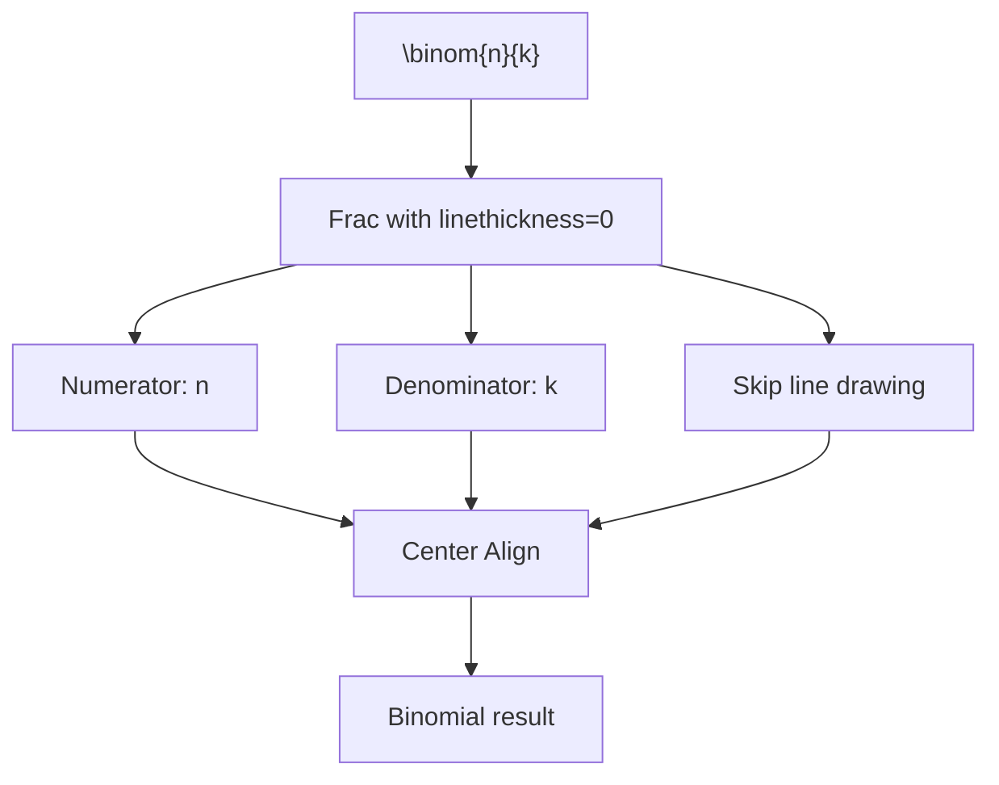
```mermaid
flowchart TB
    BINOM["\binom{n}{k}"] --> FRAC["Frac with linethickness=0"]
    
    FRAC --> NUM["Numerator: n"]
    FRAC --> DEN["Denominator: k"]
    FRAC --> NO_LINE["Skip line drawing"]
    
    NUM --> CENTER_ALIGN[Center Align]
    DEN --> CENTER_ALIGN
    NO_LINE --> CENTER_ALIGN
    
    CENTER_ALIGN --> RESULT["Binomial result"]
```

## Integration with Renderer

Math rendering integrates with the main renderer:

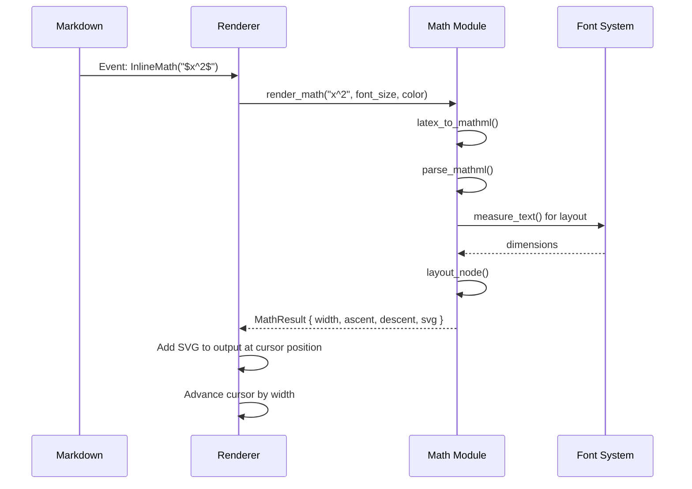
```mermaid
sequenceDiagram
    participant MD as Markdown
    participant R as Renderer
    participant M as Math Module
    participant F as Font System
    
    MD->>R: Event: InlineMath("$x^2$")
    R->>M: render_math("x^2", font_size, color)
    M->>M: latex_to_mathml()
    M->>M: parse_mathml()
    M->>F: measure_text() for layout
    F-->>M: dimensions
    M->>M: layout_node()
    M-->>R: MathResult { width, ascent, descent, svg }
    R->>R: Add SVG to output at cursor position
    R->>R: Advance cursor by width
```

### Inline vs Display Math

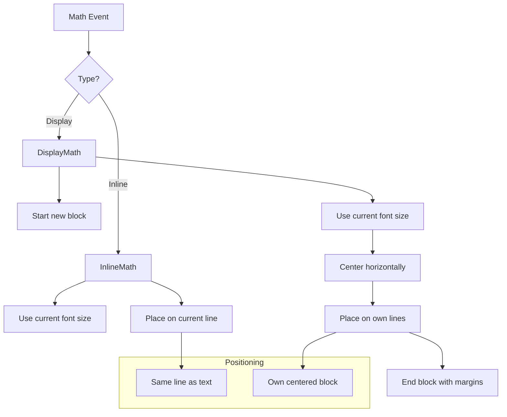
```mermaid
flowchart TB
    MATH[Math Event] --> TYPE{Type?}
    
    TYPE -->|Inline| INLINE[InlineMath]
    TYPE -->|Display| DISPLAY[DisplayMath]
    
    INLINE --> CONTEXT[Use current font size]
    INLINE --> PLACE_INLINE[Place on current line]
    
    DISPLAY --> START_BLOCK[Start new block]
    DISPLAY --> CONTEXT_D[Use current font size]
    CONTEXT_D --> CENTER[Center horizontally]
    CENTER --> PLACE_DISPLAY[Place on own lines]
    PLACE_DISPLAY --> END_BLOCK[End block with margins]
    
    subgraph Position["Positioning"]
        SAME_LINE["Same line as text"]
        OWN_LINES["Own centered block"]
    end
    
    PLACE_INLINE --> SAME_LINE
    PLACE_DISPLAY --> OWN_LINES
```

## Error Handling

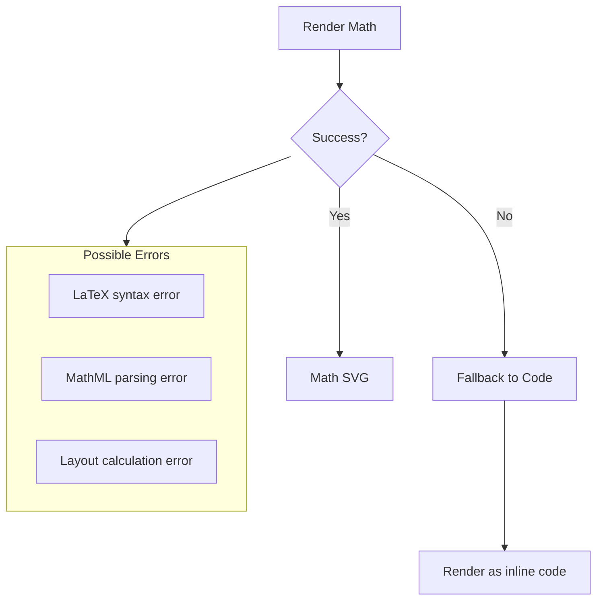
```mermaid
flowchart TB
    RENDER[Render Math] --> SUCCESS{Success?}
    
    SUCCESS -->|Yes| SVG[Math SVG]
    SUCCESS -->|No| FALLBACK[Fallback to Code]
    
    FALLBACK --> CODE_BLOCK[Render as inline code]
    
    subgraph Errors["Possible Errors"]
        LATEX_ERR["LaTeX syntax error"]
        XML_ERR["MathML parsing error"]
        LAYOUT_ERR["Layout calculation error"]
    end
    
    SUCCESS --> Errors
```

## Complete Example

Let's trace through a complete formula:

```mermaid
sequenceDiagram
    participant L as LaTeX
    participant L2M as latex2mathml
    participant P as Parser
    participant LY as Layout
    participant S as SVG
    
    L->>L2M: frac{a+b}{c}
    L2M->>P: MathML mfrac element
    
    Note over P: Parse to Frac AST node
    P->>LY: Frac AST
    
    Note over LY: Layout num and den boxes
    LY->>LY: Center and position
    
    LY->>S: Generate SVG
    Note over S: text + line + text
    S-->>L: SVG fragment
```

---

*Previous: [Output Formats](05-output-formats.md)*
