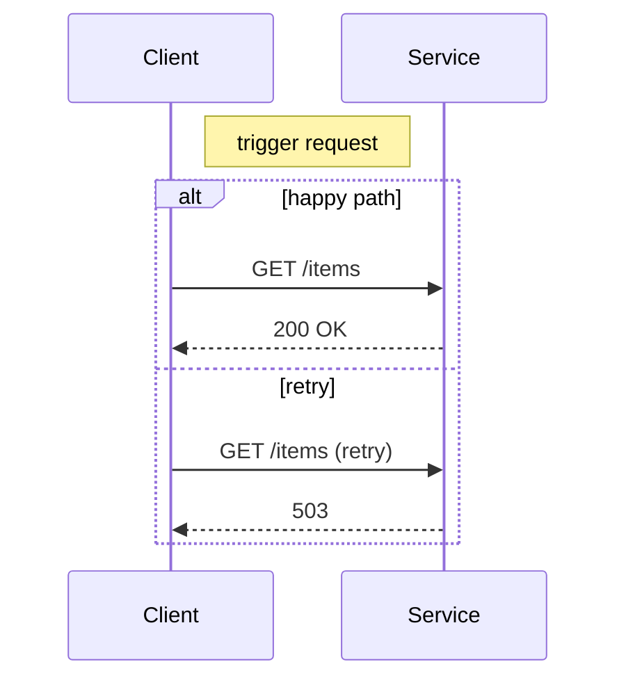
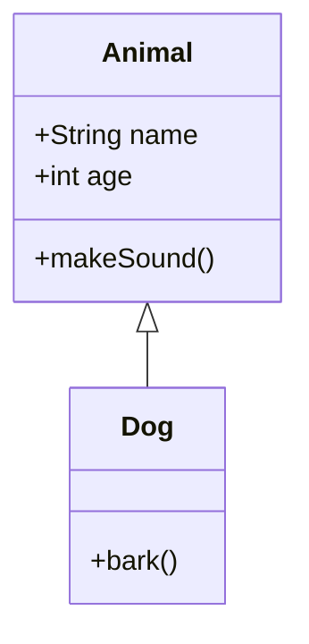
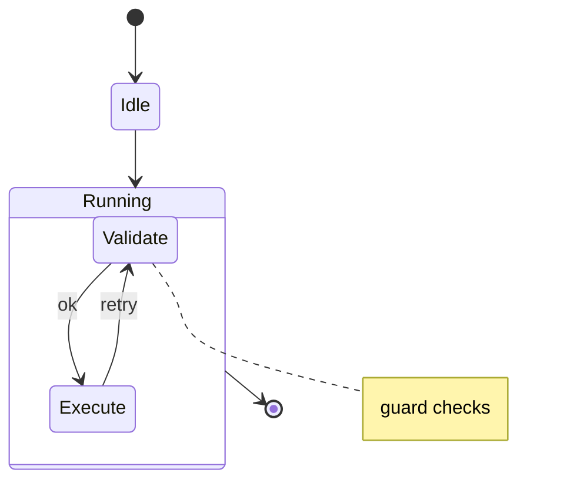

# Markie Feature Examples

This document showcases Markdown features supported by Markie, including enhanced math and native Mermaid diagrams.

## Text Formatting

You can use **bold text**, *italic text*, and `inline code` for emphasis.

~~Strikethrough text~~ is also supported.

## Links and Images

[Link text](https://example.com) renders as colored text.

Images from local files or URLs:
``

## Lists

### Unordered Lists

- Item 1
- Item 2
  - Nested item
- Item 3

### Ordered Lists

1. First item
2. Second item
3. Third item

### Task Lists

- [x] Completed task
- [ ] Pending task

## Code Blocks

```rust
fn main() {
    println!("Hello, Markie!");
}
```

## Tables

| Column 1 | Column 2 | Column 3 |
|----------|----------|----------|
| Data 1   | Data 2   | Data 3   |
| Data 4   | Data 5   | Data 6   |

## Blockquotes

> This is a blockquote.
> It can span multiple lines.

## Math

Inline math: $E = mc^2$

Display math:
$$
\sum_{i=1}^{n} x_i
$$

## Advanced Math (nth root, binomial, matrix)

Inline nth-root: $\sqrt[3]{x^3 + y^3}$

Inline binomial: $\binom{n}{k}$

Display matrix:
$$
\begin{bmatrix}
a & b \\
c & d
\end{bmatrix}
$$

Mixed expression:
$$
\sqrt[4]{\frac{a^2 + b^2}{c^2}} + \binom{n}{2}
$$

## Mermaid Diagrams

### Flowchart

```mermaid
flowchart LR
    A[API] --o> B[Gateway]
    B o-- C[Cache]
    B --x D[Rejected]
    C x--x E[Replica]
    E <.-> F[Sync]
    F ==>|fast lane| G[Ready]
```

### Sequence



### Class



### State



### ER

```mermaid
erDiagram
    CUSTOMER
    ORDER
    CUSTOMER ||--o{ ORDER
```

## Footnotes

This is a reference [^1] to a footnote.

[^1]: This is the footnote content.

## Definition Lists

Term 1
: Definition 1

Term 2
: Definition 2

## HTML

Inline `<span>` tags are rendered as code.

```html
<div>HTML blocks render as code blocks</div>
```
