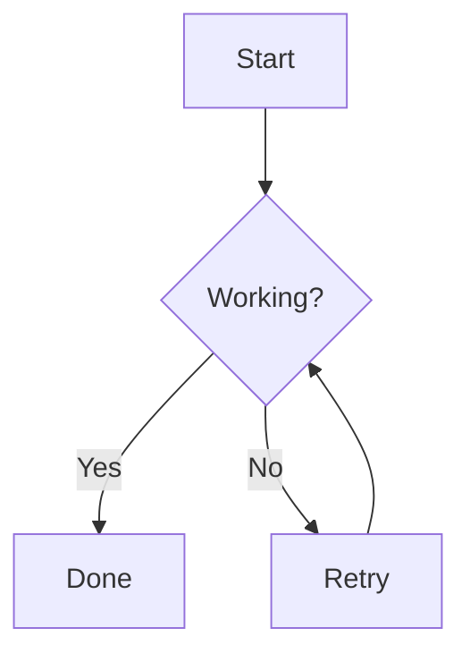
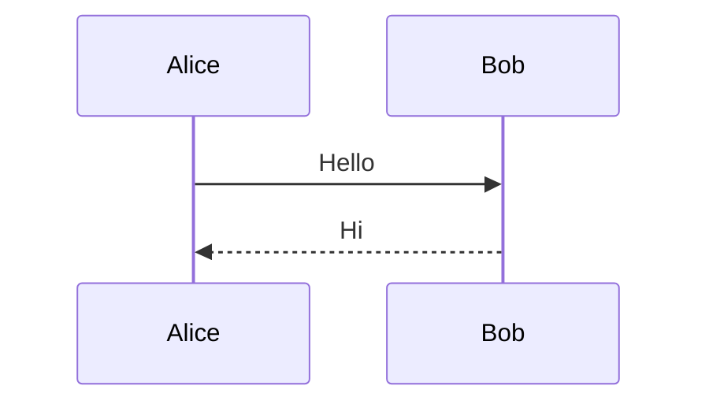
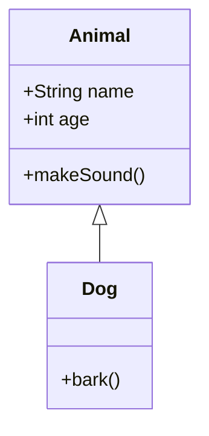
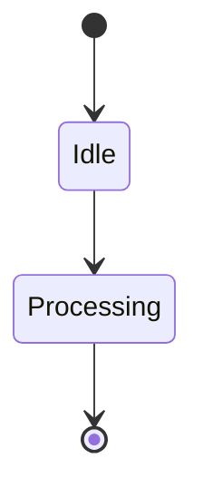

# Mermaid Smoke Test

## Flowchart

```mermaid
flowchart TD
    A[Start] --> B{Working?}
    B -->|Yes| C[Done]
    B -->|No| D[Retry]
    D --> B
```

## Sequence

```mermaid
sequenceDiagram
    participant Alice
    participant Bob
    Alice->>Bob: Hello
    Bob-->>Alice: Hi
```

## Class

```mermaid
classDiagram
    class Animal {
        +String name
        +int age
        +makeSound()
    }
    class Dog {
        +bark()
    }
    Animal <|-- Dog
```

## State

```mermaid
stateDiagram
    [*] --> Idle
    Idle --> Processing
    Processing --> [*]
```

## ER

```mermaid
erDiagram
    CUSTOMER
    ORDER
    CUSTOMER ||--o{ ORDER
```
